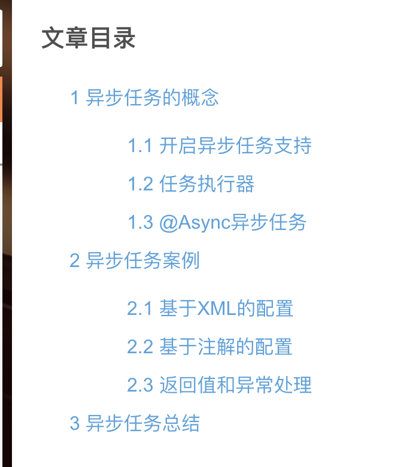
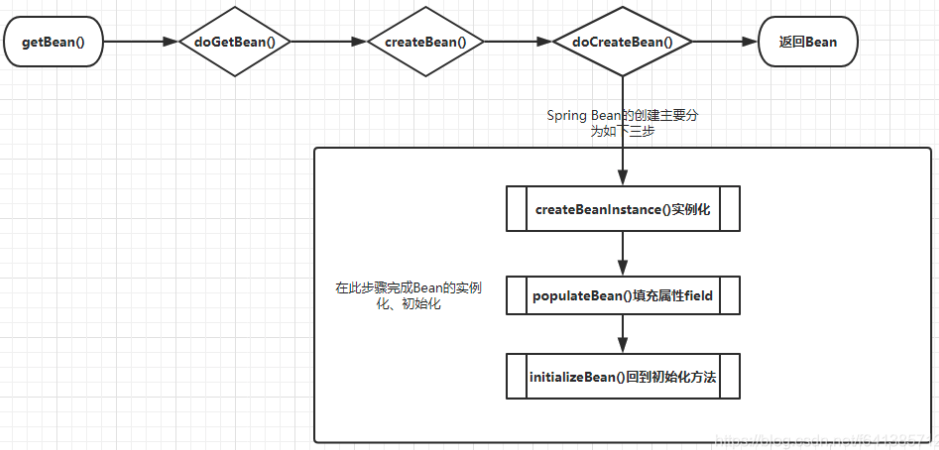
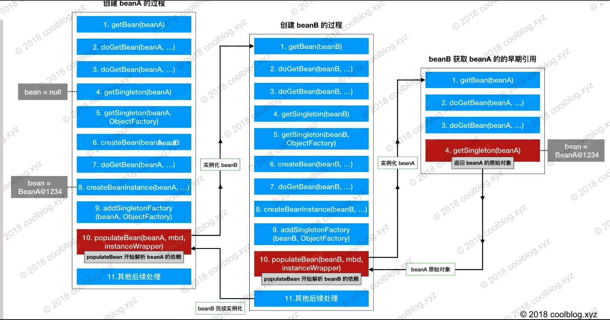
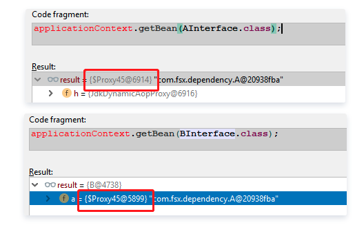
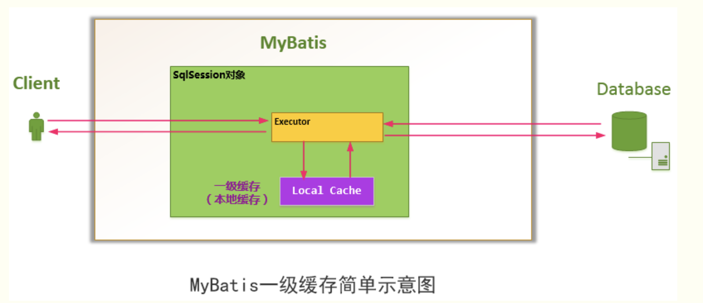
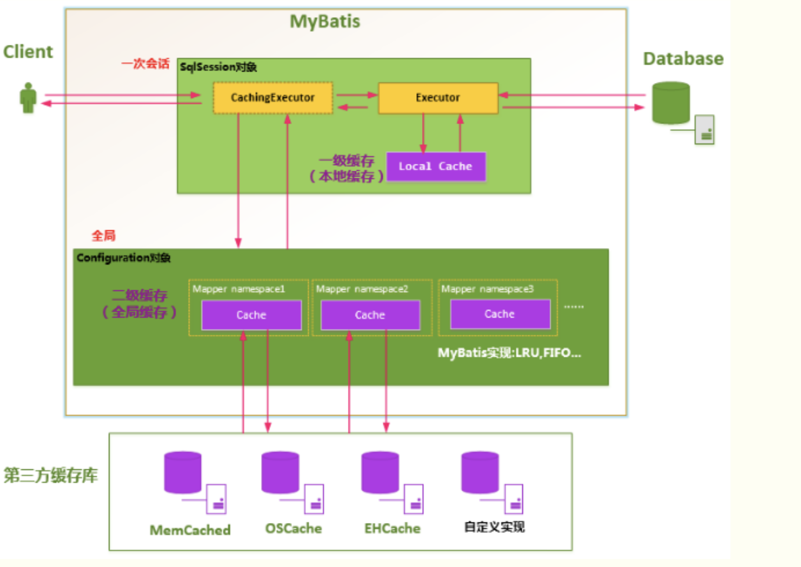

[TOC]


## Spring 专题 #####

### RequestContextHolder

【Spring】RequestContextHolder简析

>1. RequestContextHolder为什么能获取到当前的HttpServletRequest
>2. HttpServletRequest是在什么时候设置到RequestContextHolder
>
>```java
>package org.springframework.web.context.request;
>
>/**
> * Holder class to expose the web request in the form of a thread-bound
> * {@link RequestAttributes} object. The request will be inherited
> * by any child threads spawned by the current thread if the
> * {@code inheritable} flag is set to {@code true}.
> *
> * <p>Use {@link RequestContextListener} or
> * {@link org.springframework.web.filter.RequestContextFilter} to expose
> * the current web request. Note that
> * {@link org.springframework.web.servlet.DispatcherServlet}
> * already exposes the current request by default.
> *
> * @author Juergen Hoeller
> * @author Rod Johnson
> * @since 2.0
> * @see RequestContextListener
> * @see org.springframework.web.filter.RequestContextFilter
> * @see org.springframework.web.servlet.DispatcherServlet
> */
>public abstract class RequestContextHolder  {
>
>	private static final boolean jsfPresent =
>			ClassUtils.isPresent("javax.faces.context.FacesContext", RequestContextHolder.class.getClassLoader());
>
>	private static final ThreadLocal<RequestAttributes> requestAttributesHolder =
>			new NamedThreadLocal<>("Request attributes");
>
>	private static final ThreadLocal<RequestAttributes> inheritableRequestAttributesHolder =
>			new NamedInheritableThreadLocal<>("Request context");
>
>
>	/**
>	 * Reset the RequestAttributes for the current thread.
>	 */
>	public static void resetRequestAttributes() {
>		requestAttributesHolder.remove();
>		inheritableRequestAttributesHolder.remove();
>	}
>
>	/**
>	 * Bind the given RequestAttributes to the current thread,
>	 * <i>not</i> exposing it as inheritable for child threads.
>	 * @param attributes the RequestAttributes to expose
>	 * @see #setRequestAttributes(RequestAttributes, boolean)
>	 */
>	public static void setRequestAttributes(@Nullable RequestAttributes attributes) {
>		setRequestAttributes(attributes, false);
>	}
>
>	/**
>	 * Bind the given RequestAttributes to the current thread.
>	 * @param attributes the RequestAttributes to expose,
>	 * or {@code null} to reset the thread-bound context
>	 * @param inheritable whether to expose the RequestAttributes as inheritable
>	 * for child threads (using an {@link InheritableThreadLocal})
>	 */
>  //将RequestAttributes对象放入到ThreadLocal中，而HttpServletRequest和HttpServletResponse等则封装在RequestAttributes 对象中，在此处就不对RequestAttributes这个类展开。反正我们需要知道的就是要获取RequestAttributes 对象，然后再从RequestAttributes对象中获取到我们所需要的HttpServletRequest即可
>	public static void setRequestAttributes(@Nullable RequestAttributes attributes, boolean inheritable) {
>		if (attributes == null) {
>			resetRequestAttributes();
>		}
>		else {
>			if (inheritable) {
>				inheritableRequestAttributesHolder.set(attributes);
>				requestAttributesHolder.remove();
>			}
>			else {
>				requestAttributesHolder.set(attributes);
>				inheritableRequestAttributesHolder.remove();
>			}
>		}
>	}
>
>	/**
>	 * Return the RequestAttributes currently bound to the thread.
>	 * @return the RequestAttributes currently bound to the thread,
>	 * or {@code null} if none bound
>	 */
>	@Nullable
>	public static RequestAttributes getRequestAttributes() {
>		RequestAttributes attributes = requestAttributesHolder.get();
>		if (attributes == null) {
>			attributes = inheritableRequestAttributesHolder.get();
>		}
>		return attributes;
>	}
>
>	/**
>	 * Return the RequestAttributes currently bound to the thread.
>	 * <p>Exposes the previously bound RequestAttributes instance, if any.
>	 * Falls back to the current JSF FacesContext, if any.
>	 * @return the RequestAttributes currently bound to the thread
>	 * @throws IllegalStateException if no RequestAttributes object
>	 * is bound to the current thread
>	 * @see #setRequestAttributes
>	 * @see ServletRequestAttributes
>	 * @see FacesRequestAttributes
>	 * @see javax.faces.context.FacesContext#getCurrentInstance()
>	 */
>	public static RequestAttributes currentRequestAttributes() throws IllegalStateException {
>		RequestAttributes attributes = getRequestAttributes();
>		if (attributes == null) {
>			if (jsfPresent) {
>				attributes = FacesRequestAttributesFactory.getFacesRequestAttributes();
>			}
>			if (attributes == null) {
>				throw new IllegalStateException("No thread-bound request found: " +
>						"Are you referring to request attributes outside of an actual web request, " +
>						"or processing a request outside of the originally receiving thread? " +
>						"If you are actually operating within a web request and still receive this message, " +
>						"your code is probably running outside of DispatcherServlet: " +
>						"In this case, use RequestContextListener or RequestContextFilter to expose the current request.");
>			}
>		}
>		return attributes;
>	}
>
>
>	/**
>	 * Inner class to avoid hard-coded JSF dependency.
> 	 */
>	private static class FacesRequestAttributesFactory {
>
>		@Nullable
>		public static RequestAttributes getFacesRequestAttributes() {
>			FacesContext facesContext = FacesContext.getCurrentInstance();
>			return (facesContext != null ? new FacesRequestAttributes(facesContext) : null);
>		}
>	}
>
>}
>
>```
>
>org.springframework.web.servlet.FrameworkServlet#processRequest
>
>```java
>protected final void processRequest(HttpServletRequest request, HttpServletResponse response) throws ServletException, IOException {
>        long startTime = System.currentTimeMillis();
>        Throwable failureCause = null;
>        LocaleContext previousLocaleContext = LocaleContextHolder.getLocaleContext();
>        LocaleContext localeContext = this.buildLocaleContext(request);
>        RequestAttributes previousAttributes = RequestContextHolder.getRequestAttributes();
>        ServletRequestAttributes requestAttributes = this.buildRequestAttributes(request, response, previousAttributes);
>        WebAsyncManager asyncManager = WebAsyncUtils.getAsyncManager(request);
>        asyncManager.registerCallableInterceptor(FrameworkServlet.class.getName(), new FrameworkServlet.RequestBindingInterceptor());
>  // 初始化 RequestContextHolder 容器
>        this.initContextHolders(request, localeContext, requestAttributes);
>
>        try {
>            this.doService(request, response);
>        } catch (IOException | ServletException var16) {
>            failureCause = var16;
>            throw var16;
>        } catch (Throwable var17) {
>            failureCause = var17;
>            throw new NestedServletException("Request processing failed", var17);
>        } finally {
>            this.resetContextHolders(request, previousLocaleContext, previousAttributes);
>            if (requestAttributes != null) {
>                requestAttributes.requestCompleted();
>            }
>
>            this.logResult(request, response, (Throwable)failureCause, asyncManager);
>            this.publishRequestHandledEvent(request, response, startTime, (Throwable)failureCause);
>        }
>
>    }
>```
>
> 最终在` this.initContextHolders(request, localeContext, requestAttributes);` 中调用了这个方法：
>
>`org.springframework.web.context.request.RequestContextHolder#setRequestAttributes(org.springframework.web.context.request.RequestAttributes, boolean)`
>
>```java
>	public static void setRequestAttributes(@Nullable RequestAttributes attributes, boolean inheritable) {
>		if (attributes == null) {
>			resetRequestAttributes();
>		}
>		else {
>			if (inheritable) {
>				inheritableRequestAttributesHolder.set(attributes);
>				requestAttributesHolder.remove();
>			}
>			else {
>				requestAttributesHolder.set(attributes);
>				inheritableRequestAttributesHolder.remove();
>			}
>		}
>	}
>```
>
>简单看下源码，我们可以知道HttpServletRequest是在执行doService方法之前，也就是具体的业务逻辑前进行设置的，然后在执行完业务逻辑或者抛出异常时重置RequestContextHolder移除当前的HttpServletRequest。

### 【Spring】Spring底层核心原理解析

https://blog.csdn.net/haohaoxuexiyai/article/details/123003882

### Spring 如何管理 bean

存入 map 的数据结构中：

org.springframework.beans.factory.support.DefaultListableBeanFactory#beanDefinitionMap

```java
/** Map of bean definition objects, keyed by bean name. */
private final Map<String, BeanDefinition> beanDefinitionMap = new ConcurrentHashMap<>(256);
```

### Spring 如何创建 bean

org.springframework.beans.factory.support.AbstractAutowireCapableBeanFactory#doCreateBean

```java
protected Object doCreateBean(String beanName, RootBeanDefinition mbd, @Nullable Object[] args)
			throws BeanCreationException {

		// Instantiate the bean.
		BeanWrapper instanceWrapper = null;
		if (mbd.isSingleton()) {
			instanceWrapper = this.factoryBeanInstanceCache.remove(beanName);
		}
		if (instanceWrapper == null) {
			instanceWrapper = createBeanInstance(beanName, mbd, args);
		}
		Object bean = instanceWrapper.getWrappedInstance();
		Class<?> beanType = instanceWrapper.getWrappedClass();
		if (beanType != NullBean.class) {
			mbd.resolvedTargetType = beanType;
		}

		// Allow post-processors to modify the merged bean definition.
		synchronized (mbd.postProcessingLock) {
			if (!mbd.postProcessed) {
				try {
					applyMergedBeanDefinitionPostProcessors(mbd, beanType, beanName);
				}
				catch (Throwable ex) {
					throw new BeanCreationException(mbd.getResourceDescription(), beanName,
							"Post-processing of merged bean definition failed", ex);
				}
				mbd.postProcessed = true;
			}
		}

		// Eagerly cache singletons to be able to resolve circular references
		// even when triggered by lifecycle interfaces like BeanFactoryAware.
		boolean earlySingletonExposure = (mbd.isSingleton() && this.allowCircularReferences &&
				isSingletonCurrentlyInCreation(beanName));
		if (earlySingletonExposure) {
			if (logger.isTraceEnabled()) {
				logger.trace("Eagerly caching bean '" + beanName +
						"' to allow for resolving potential circular references");
			}
			addSingletonFactory(beanName, () -> getEarlyBeanReference(beanName, mbd, bean));
		}

		// Initialize the bean instance.
		Object exposedObject = bean;
		try {
			populateBean(beanName, mbd, instanceWrapper);
			exposedObject = initializeBean(beanName, exposedObject, mbd);
		}
		catch (Throwable ex) {
			if (ex instanceof BeanCreationException && beanName.equals(((BeanCreationException) ex).getBeanName())) {
				throw (BeanCreationException) ex;
			}
			else {
				throw new BeanCreationException(
						mbd.getResourceDescription(), beanName, "Initialization of bean failed", ex);
			}
		}

		if (earlySingletonExposure) {
			Object earlySingletonReference = getSingleton(beanName, false);
			if (earlySingletonReference != null) {
				if (exposedObject == bean) {
					exposedObject = earlySingletonReference;
				}
				else if (!this.allowRawInjectionDespiteWrapping && hasDependentBean(beanName)) {
					String[] dependentBeans = getDependentBeans(beanName);
					Set<String> actualDependentBeans = new LinkedHashSet<>(dependentBeans.length);
					for (String dependentBean : dependentBeans) {
						if (!removeSingletonIfCreatedForTypeCheckOnly(dependentBean)) {
							actualDependentBeans.add(dependentBean);
						}
					}
					if (!actualDependentBeans.isEmpty()) {
						throw new BeanCurrentlyInCreationException(beanName,
								"Bean with name '" + beanName + "' has been injected into other beans [" +
								StringUtils.collectionToCommaDelimitedString(actualDependentBeans) +
								"] in its raw version as part of a circular reference, but has eventually been " +
								"wrapped. This means that said other beans do not use the final version of the " +
								"bean. This is often the result of over-eager type matching - consider using " +
								"'getBeanNamesForType' with the 'allowEagerInit' flag turned off, for example.");
					}
				}
			}
		}

		// Register bean as disposable.
		try {
			registerDisposableBeanIfNecessary(beanName, bean, mbd);
		}
		catch (BeanDefinitionValidationException ex) {
			throw new BeanCreationException(
					mbd.getResourceDescription(), beanName, "Invalid destruction signature", ex);
		}

		return exposedObject;
	}
```

### [@Async Spring异步任务的深入学习与使用](https://blog.csdn.net/weixin_43767015/article/details/110135495) 讲得全面，简洁，容易理解

>
>

### [【小家Spring】Spring异步处理@Async的使用以及原理、源码分析（@EnableAsync）](https://blog.csdn.net/f641385712/article/details/89430276)   ???


### [【小家Spring】从基于@Transactional全注解方式的声明式事务入手，彻底掌握Spring事务管理的原理](https://blog.csdn.net/f641385712/article/details/89607829)   ???

### [一文告诉你Spring是如何利用“三级缓存“巧妙解决Bean的循环依赖问题的【享学Spring】](https://blog.csdn.net/f641385712/article/details/92801300)

构造器注入构成的循环依赖，此种循环依赖方式是无法解决的，只能抛出BeanCurrentlyInCreationException异常表示循环依赖。这也是构造器注入的最大劣势（它有很多独特的优势，请小伙伴自行发掘）

根本原因：**Spring解决循环依赖依靠的是Bean的“中间态”这个概念，而这个中间态指的是已经实例化，但还没初始化的状态。而构造器是完成实例化的东东，所以构造器的循环依赖无法解决**~~~
备注：setter方法注入方式因为原理和字段注入方式类似，此处不多加演示：

Spring创建Bean的流程
首先需要了解是Spring它创建Bean的流程，我把它的大致调用栈绘图如下：



对Bean的创建最为核心三个方法解释如下：

createBeanInstance：实例化，其实也就是调用对象的构造方法实例化对象
populateBean：填充属性，这一步主要是对bean的依赖属性进行注入(@Autowired)
initializeBean：回到一些形如initMethod、InitializingBean等方法
从对单例Bean的初始化可以看出，循环依赖主要发生在第二步（populateBean），也就是field属性注入的处理。

Spring容器的'三级缓存'
在Spring容器的整个声明周期中，单例Bean有且仅有一个对象。这很容易让人想到可以用缓存来加速访问。
从源码中也可以看出Spring大量运用了Cache的手段，在循环依赖问题的解决过程中甚至不惜使用了“三级缓存”，这也便是它设计的精妙之处~

三级缓存其实它更像是Spring容器工厂的内的术语，采用三级缓存模式来解决循环依赖问题，这三级缓存分别指：

```java
public class DefaultSingletonBeanRegistry extends SimpleAliasRegistry implements SingletonBeanRegistry {
	...
	// 从上至下 分表代表这“三级缓存”
	private final Map<String, Object> singletonObjects = new ConcurrentHashMap<>(256); //一级缓存
	private final Map<String, Object> earlySingletonObjects = new HashMap<>(16); // 二级缓存
	private final Map<String, ObjectFactory<?>> singletonFactories = new HashMap<>(16); // 三级缓存
	...
	
	/** Names of beans that are currently in creation. */
	// 这个缓存也十分重要：它表示bean创建过程中都会在里面呆着~
	// 它在Bean开始创建时放值，创建完成时会将其移出~
	private final Set<String> singletonsCurrentlyInCreation = Collections.newSetFromMap(new ConcurrentHashMap<>(16));

	/** Names of beans that have already been created at least once. */
	// 当这个Bean被创建完成后，会标记为这个 注意：这里是set集合 不会重复
	// 至少被创建了一次的  都会放进这里~~~~
	private final Set<String> alreadyCreated = Collections.newSetFromMap(new ConcurrentHashMap<>(256));
}

```

注：AbstractBeanFactory继承自DefaultSingletonBeanRegistry~

singletonObjects：用于存放完全初始化好的 bean，从该缓存中取出的 bean 可以直接使用
earlySingletonObjects：提前曝光的单例对象的cache，存放原始的 bean 对象（尚未填充属性），用于解决循环依赖
singletonFactories：单例对象工厂的cache，存放 bean 工厂对象，用于解决循环依赖

```java
public class DefaultSingletonBeanRegistry extends SimpleAliasRegistry implements SingletonBeanRegistry {
	...
	@Override
	@Nullable
	public Object getSingleton(String beanName) {
		return getSingleton(beanName, true);
	}
	@Nullable
	protected Object getSingleton(String beanName, boolean allowEarlyReference) {
		Object singletonObject = this.singletonObjects.get(beanName);
		if (singletonObject == null && isSingletonCurrentlyInCreation(beanName)) {
			synchronized (this.singletonObjects) {
				singletonObject = this.earlySingletonObjects.get(beanName);
				if (singletonObject == null && allowEarlyReference) {
					ObjectFactory<?> singletonFactory = this.singletonFactories.get(beanName);
					if (singletonFactory != null) {
						singletonObject = singletonFactory.getObject();
						this.earlySingletonObjects.put(beanName, singletonObject);
						this.singletonFactories.remove(beanName);
					}
				}
			}
		}
		return singletonObject;
	}
	...
	public boolean isSingletonCurrentlyInCreation(String beanName) {
		return this.singletonsCurrentlyInCreation.contains(beanName);
	}
	protected boolean isActuallyInCreation(String beanName) {
		return isSingletonCurrentlyInCreation(beanName);
	}
	...
}

```

1. **先从一级缓存singletonObjects中去获取。（如果获取到就直接return）**
2. **如果获取不到或者对象正在创建中（isSingletonCurrentlyInCreation()），那就再从二级缓存earlySingletonObjects中获取。（如果获取到就直接return）.**
3. **如果还是获取不到，且允许singletonFactories（allowEarlyReference=true）通过getObject()获取。就从三级缓存singletonFactory.getObject()获取。（如果获取到了就从singletonFactories中移除，并且放进earlySingletonObjects。其实也就是从三级缓存移动（是剪切、不是复制哦~）到了二级缓存）.**

getSingleton() 从缓存里获取单例对象步骤分析可知，Spring 解决循环依赖的诀窍：就在于singletonFactories 这个三级缓存。这个Cache里面都是 ObjectFactory，它是解决问题的关键。

```java
// 它可以将创建对象的步骤封装到ObjectFactory中 交给自定义的Scope来选择是否需要创建对象来灵活的实现scope。  具体参见Scope接口
@FunctionalInterface
public interface ObjectFactory<T> {
	T getObject() throws BeansException;
}
```

经过 ObjectFactory.getObject() 后，此时放进了二级缓存earlySingletonObjects内。**这个时候对象已经实例化了，虽然还不完美，但是对象的引用已经可以被其它引用了。**

**此处说一下二级缓存 earlySingletonObjects 它里面的数据什么时候添加什么移除？？?**

添加：向里面添加数据只有一个地方，就是上面说的getSingleton()里从三级缓存里挪过来
移除：addSingleton、addSingletonFactory、removeSingleton从语义中可以看出添加单例、添加单例工厂ObjectFactory的时候都会删除二级缓存里面对应的缓存值，是互斥的.

**循环依赖对AOP代理对象创建流程和结果的影响**
我们都知道Spring AOP、事务等都是通过代理对象来实现的，而事务的代理对象是由自动代理创建器来自动完成的。也就是说Spring最终给我们放进容器里面的是一个代理对象，而非原始对象。

本文结合循环依赖，回头再看AOP代理对象的创建过程，和最终放进容器内的动作，非常有意思。



由上可知，**自动代理创建器它保证了代理对象只会被创建一次，而且支持循环依赖的自动注入的依旧是代理对象。**


### [高频面试题：Spring 如何解决循环依赖？](https://zhuanlan.zhihu.com/p/84267654)

对于整体过程，读者朋友只要理解两点：

- Spring是通过递归的方式获取目标bean及其所依赖的bean的；
- Spring实例化一个bean的时候，是分两步进行的，首先实例化目标bean，然后为其注入属性。

结合这两点，也就是说，Spring在实例化一个bean的时候，是首先递归的实例化其所依赖的所有bean，直到某个bean没有依赖其他bean，此时就会将该实例返回，然后反递归的将获取到的bean设置为各个上层bean的属性的。

spring 默认使用三级缓存解决循环依赖问题。特殊情况下会导致循环依赖失效。 比如 1.互相循环依赖使用构造器注入。 2. 通过类似 @Async 注解在对象初始化时期被生成代理对象替换原对象原因

### [使用@Async异步注解导致该Bean在循环依赖时启动报BeanCurrentlyInCreationException异常的根本原因分析，以及提供解决方案【享学Spring】](https://cloud.tencent.com/developer/article/1497689)

```java
@Service
public class HelloServiceImpl implements HelloService {
    @Autowired
    private HelloService helloService;
    
    @Override
    public Object hello(Integer id) {
        System.out.println("线程名称：" + Thread.currentThread().getName());
        helloService.fun1(); // 使用接口方式调用，而不是this
        return "service hello";
    }

    @Async
    @Override
    public void fun1() {
        System.out.println("线程名称：" + Thread.currentThread().getName());
    }
}
```

**本以为能够像解决事务不生效问题一样依旧`屡试不爽`**，但没想到非常的不给面子，启动即报错：

```java
org.springframework.beans.factory.BeanCurrentlyInCreationException: Error creating bean with name 'helloServiceImpl': Bean with name 'helloServiceImpl' has been injected into other beans [helloServiceImpl] in its raw version as part of a circular reference, but has eventually been wrapped. This means that said other beans do not use the final version of the bean. This is often the result of over-eager type matching - consider using 'getBeanNamesOfType' with the 'allowEagerInit' flag turned off, for example.
	at org.springframework.beans.factory.support.AbstractAutowireCapableBeanFactory.doCreateBean(AbstractAutowireCapableBeanFactory.java:622)
	at org.springframework.beans.factory.support.AbstractAutowireCapableBeanFactory.createBean(AbstractAutowireCapableBeanFactory.java:515)
	at org.springframework.beans.factory.support.AbstractBeanFactory.lambda$doGetBean$0(AbstractBeanFactory.java:320)
	at org.springframework.beans.factory.support.DefaultSingletonBeanRegistry.getSingleton(DefaultSingletonBeanRegistry.java:222)
	at org.springframework.beans.factory.support.AbstractBeanFactory.doGetBean(AbstractBeanFactory.java:318)
	at org.springframework.beans.factory.support.AbstractBeanFactory.getBean(AbstractBeanFactory.java:199)
	...
```

这里说明一下，为什么有小伙伴跟我说：我使用`@Async`即使本类方法调用也从来木有遇到这个错误啊？难道它不常见？ **为此经过我的一番调查，包括看一些同事、小伙伴的代码发现**：并不是使用`@Async`没有启动报错，而是他本类调用的时候直接调用的方法，这样`@Async`是不生效的但小伙伴却**全然不知**而已。

**至于`@Async`没生效这种问题为何没报出来？？？甚至过了很久很久都没人发现和关注？？** 其实道理很简单，**它和事务不生效**不一样，`@Async`若没生效99%情况下都不会影响到业务的正常进行，因为它不会影响数据正确性，只会影响到性能（无非就是异步变同步呗，这是兼容的）。

**说明：Spring管理的Bean都是单例的，所以Spring默认需要保证所有`使用`此Bean的地方都指向的是同一个地址，也就是最终版本的Bean，否则可能就乱套了，Spring也提供了这样的自检机制~**

* **解决方案**

2、使用`@Lazy`或者`@ComponentScan(lazyInit = true)`解决

本处以使用`@Lazy`为例：（**强烈不建议**使用`@ComponentScan(lazyInit = true)`作用范围太广了，容易产生误伤）

```javascript
@Service
public class B implements BInterface {
    @Lazy
    @Autowired
    private AInterface a;

    @Override
    public void funB() {
        System.out.println("线程名称：" + Thread.currentThread().getName());
        a.funA();
    }
}
```

>  注意此`@Lazy`注解加的位置，因为a最终会是`@Async`的代理对象，所以在`@Autowired`它的地方加 另外，若不存在循环依赖而是直接引用a，是不用加`@Lazy`的 

只需要在Bean b的依赖属性上加上`@Lazy`即可。（因为是B希望依赖进来的是最终的代理对象进来，所以B加上即可，A上并不需要加）

最终的结果让人满意：启动正常，并且`@Async`异步效果也生效了，**因此本方案我是推荐的**

但是需要稍微注意的是：此种情况下B里持有A的引用和Spring容器里的A`并不是同一个`，如下图： 



 两处实例a的地址值是不一样的，容器内的是`$Proxy@6914`,B持有的是`$Proxy@5899`。

>  关于`@Autowired`和`@Lazy`的联合使用为何是此现象，其实`@Lazy`的代理对象是由`ContextAnnotationAutowireCandidateResolver`生成的，具体参考博文：[【小家Spring】Spring依赖注入(DI)核心接口AutowireCandidateResolver深度分析，解析@Lazy、@Qualifier注解的原理](https://blog.csdn.net/f641385712/article/details/93620967) 

### H3 深入理解 Spring @Lazy 注解以及最佳实践

>## 1 概述
>
>- org.springframework.context.annotation.Lazy
>
>**`@Lazy` 注解可以提高系统加载速度，`@Component` 注解的 Bean，在启动的时候不会被初始化，只有通过 ApplicationContext 对象的 getBean 方法获取的时候才会初始化；**
>
>用于指定单例bean实例化的时机，在没有指定此注解时，单例会在容器初始化时就被创建。而当使用此注解后，单例对象的创建时机会在该bean在被第一次使用时创建，并且只创建一次。第二次及以后获取使用就不再创建。
>
>在实际开发场景中，并不是所有bean都要一开始就被创建的，有些可以等到使用时才创建。此时就可以使用该注解实现。
>
>此注解只对单例bean有用，原型bean时此注解不起作用。

### 为何@Transactional即使循环依赖也没有问题呢？

最后回答小伙伴给我提问的这个问题：**同为**创建动态代理对象，**同为**一个注解标注在类上 / 方法上，为何`@Transactional`就不会出现这种启动报错呢？

其实这个问题的答案在上篇文章的后半拉已经解释了，详见 [【小家Spring】一文告诉你Spring是如何利用"三级缓存"巧妙解决Bean的循环依赖问题的](https://blog.csdn.net/f641385712/article/details/92801300)

虽说他俩的原理都是产生代理对象，且注解的使用方式几乎无异。so区别Spring对它哥俩的解析不同，也就是他们代理的创建的方式不同：

- **`@Transactional`使用的是自动代理创建器`AbstractAutoProxyCreator`，上篇文章详细描述了，它实现了`getEarlyBeanReference()`方法从而很好的对循环依赖提供了支持**
- **`@Async`的代理创建使用的是`AsyncAnnotationBeanPostProcessor`单独的后置处理器实现的，它只在一处`postProcessAfterInitialization()`实现了对代理对象的创建，因此若出现它被`循环依赖`了，就会报错如上~~~**

so，虽然从表象上看这两个注解的实现方式一样，但细咬其实现过程细节上，两者差异性还是非常明显的。了解了实现方式上的差异后，自然就不难理解为何有报错和有不报错了~

### [@Async注解使用不当引发的spring循环依赖思考](https://segmentfault.com/a/1190000021217176)

https://segmentfault.com/a/1190000021217176

>**循环依赖分析**
>
>我们知道，spring注入bean的方式有三种：
>
>```markdown
>1. 构造器注入
>2. setter
>3. 自动注入
>```
>
>
>
>```text
>protected Object doCreateBean( ... ){
>...
>boolean earlySingletonExposure = (mbd.isSingleton() && this.allowCircularReferences && isSingletonCurrentlyInCreation(beanName));
>if (earlySingletonExposure) {
>    addSingletonFactory(beanName, () -> getEarlyBeanReference(beanName, mbd, bean));
>}
>...
>
>// populateBean这一句特别的关键，它需要给A的属性赋值，所以此处会去实例化B~~
>// 而B我们从上可以看到它就是个普通的Bean（并不需要创建代理对象），实例化完成之后，继续给他的属性A赋值，而此时它会去拿到A的早期引用
>// 也就在此处在给B的属性a赋值的时候，会执行到上面放进去的Bean A流程中的getEarlyBeanReference()方法  从而拿到A的早期引用~~
>// 执行A的getEarlyBeanReference()方法的时候，会执行自动代理创建器，但是由于A没有标注事务，所以最终不会创建代理，so B合格属性引用会是A的**原始对象**
>// 需要注意的是：@Async的代理对象不是在getEarlyBeanReference()中创建的，是在postProcessAfterInitialization创建的代理
>// 从这我们也可以看出@Async的代理它默认并不支持你去循环引用，因为它并没有把代理对象的早期引用提供出来~~~（注意这点和自动代理创建器的区别~）
>
>// 结论：此处给A的依赖属性字段B赋值为了B的实例(因为B不需要创建代理，所以就是原始对象)
>// 而此处实例B里面依赖的A注入的仍旧为Bean A的普通实例对象（注意  是原始对象非代理对象）  注：此时exposedObject也依旧为原始对象
>populateBean(beanName, mbd, instanceWrapper);
>
>
>
>// 标注有@Async的Bean的代理对象在此处会被生成~~~ 参照类：AsyncAnnotationBeanPostProcessor
>// 所以此句执行完成后  exposedObject就会是个代理对象而非原始对象了
>exposedObject = initializeBean(beanName, exposedObject, mbd);
>
>...
>// 这里是报错的重点~~~
>if (earlySingletonExposure) {
>    // 上面说了A被B循环依赖进去了，所以此时A是被放进了二级缓存的，所以此处earlySingletonReference 是A的原始对象的引用
>    // （这也就解释了为何我说：如果A没有被循环依赖，是不会报错不会有问题的   因为若没有循环依赖earlySingletonReference =null后面就直接return了）
>    Object earlySingletonReference = getSingleton(beanName, false);
>    if (earlySingletonReference != null) {
>        // 上面分析了exposedObject 是被@Aysnc代理过的对象， 而bean是原始对象 所以此处不相等  走else逻辑
>        if (exposedObject == bean) {
>            exposedObject = earlySingletonReference;
>        }
>        // allowRawInjectionDespiteWrapping 标注是否允许此Bean的原始类型被注入到其它Bean里面，即使自己最终会被包装（代理）
>        // 默认是false表示不允许，如果改为true表示允许，就不会报错啦。这是我们后面讲的决方案的其中一个方案~~~
>        // 另外dependentBeanMap记录着每个Bean它所依赖的Bean的Map~~~~
>        else if (!this.allowRawInjectionDespiteWrapping && hasDependentBean(beanName)) {
>            // 我们的Bean A依赖于B，so此处值为["b"]
>            String[] dependentBeans = getDependentBeans(beanName);
>            Set<String> actualDependentBeans = new LinkedHashSet<>(dependentBeans.length);
>
>            // 对所有的依赖进行一一检查~    比如此处B就会有问题
>            // “b”它经过removeSingletonIfCreatedForTypeCheckOnly最终返返回false  因为alreadyCreated里面已经有它了表示B已经完全创建完成了~~~
>            // 而b都完成了，所以属性a也赋值完成儿聊 但是B里面引用的a和主流程我这个A竟然不相等，那肯定就有问题(说明不是最终的)~~~
>            // so最终会被加入到actualDependentBeans里面去，表示A真正的依赖~~~
>            for (String dependentBean : dependentBeans) {
>                if (!removeSingletonIfCreatedForTypeCheckOnly(dependentBean)) {
>                    actualDependentBeans.add(dependentBean);
>                }
>            }
>
>            // 若存在这种真正的依赖，那就报错了~~~  则个异常就是上面看到的异常信息
>            if (!actualDependentBeans.isEmpty()) {
>                throw new BeanCurrentlyInCreationException(beanName,
>                        "Bean with name '" + beanName + "' has been injected into other beans [" +
>                        StringUtils.collectionToCommaDelimitedString(actualDependentBeans) +
>                        "] in its raw version as part of a circular reference, but has eventually been " +
>                        "wrapped. This means that said other beans do not use the final version of the " +
>                        "bean. This is often the result of over-eager type matching - consider using " +
>                        "'getBeanNamesOfType' with the 'allowEagerInit' flag turned off, for example.");
>            }
>        }
>    }
>}
>...
>}
>
>```
>
>**这里知识点避开不@Aysnc注解标注的Bean的创建代理的时机。**
>**@EnableAsync开启时它会向容器内注入AsyncAnnotationBeanPostProcessor，它是一个BeanPostProcessor，实现了postProcessAfterInitialization方法。此处我们看代码，创建代理的动作在抽象父类AbstractAdvisingBeanPostProcessor上：**
>
>```text
>// @since 3.2   注意：@EnableAsync在Spring3.1后出现
>// 继承自ProxyProcessorSupport，所以具有动态代理相关属性~ 方便创建代理对象
>public abstract class AbstractAdvisingBeanPostProcessor extends ProxyProcessorSupport implements BeanPostProcessor {
>
>// 这里会缓存所有被处理的Bean~~~  eligible：合适的
>private final Map<Class<?>, Boolean> eligibleBeans = new ConcurrentHashMap<>(256);
>
>//postProcessBeforeInitialization方法什么不做~
>@Override
>public Object postProcessBeforeInitialization(Object bean, String beanName) {
>    return bean;
>}
>
>// 关键是这里。当Bean初始化完成后这里会执行，这里会决策看看要不要对此Bean创建代理对象再返回~~~
>@Override
>public Object postProcessAfterInitialization(Object bean, String beanName) {
>    if (this.advisor == null || bean instanceof AopInfrastructureBean) {
>        // Ignore AOP infrastructure such as scoped proxies.
>        return bean;
>    }
>
>    // 如果此Bean已经被代理了（比如已经被事务那边给代理了~~）
>    if (bean instanceof Advised) {
>        Advised advised = (Advised) bean;
>    
>        // 此处拿的是AopUtils.getTargetClass(bean)目标对象，做最终的判断
>        // isEligible()是否合适的判断方法  是本文最重要的一个方法，下文解释~
>        // 此处还有个小细节：isFrozen为false也就是还没被冻结的时候，就只向里面添加一个切面接口   并不要自己再创建代理对象了  省事
>        if (!advised.isFrozen() && isEligible(AopUtils.getTargetClass(bean))) {
>            // Add our local Advisor to the existing proxy's Advisor chain...
>            // beforeExistingAdvisors决定这该advisor最先执行还是最后执行
>            // 此处的advisor为：AsyncAnnotationAdvisor  它切入Class和Method标注有@Aysnc注解的地方~~~
>            if (this.beforeExistingAdvisors) {
>                advised.addAdvisor(0, this.advisor);
>            } else {
>                advised.addAdvisor(this.advisor);
>            }
>            return bean;
>        }
>    }
>
>    // 若不是代理对象，此处就要下手了~~~~isEligible() 这个方法特别重要
>    if (isEligible(bean, beanName)) {
>        // copy属性  proxyFactory.copyFrom(this); 生成一个新的ProxyFactory 
>        ProxyFactory proxyFactory = prepareProxyFactory(bean, beanName);
>        // 如果没有强制采用CGLIB 去探测它的接口~
>        if (!proxyFactory.isProxyTargetClass()) {
>            evaluateProxyInterfaces(bean.getClass(), proxyFactory);
>        }
>        // 添加进此切面~~ 最终为它创建一个getProxy 代理对象
>        proxyFactory.addAdvisor(this.advisor);
>        //customize交给子类复写（实际子类目前都没有复写~）
>        customizeProxyFactory(proxyFactory);
>        return proxyFactory.getProxy(getProxyClassLoader());
>    }
>
>    // No proxy needed.
>    return bean;
>}
>
>// 我们发现BeanName最终其实是没有用到的~~~
>// 但是子类AbstractBeanFactoryAwareAdvisingPostProcessor是用到了的  没有做什么 可以忽略~~~
>protected boolean isEligible(Object bean, String beanName) {
>    return isEligible(bean.getClass());
>}
>protected boolean isEligible(Class<?> targetClass) {
>    // 首次进来eligible的值肯定为null~~~
>    Boolean eligible = this.eligibleBeans.get(targetClass);
>    if (eligible != null) {
>        return eligible;
>    }
>    // 如果根本就没有配置advisor  也就不用看了~
>    if (this.advisor == null) {
>        return false;
>    }
>    
>    // 最关键的就是canApply这个方法，如果AsyncAnnotationAdvisor  能切进它  那这里就是true
>    // 本例中方法标注有@Aysnc注解，所以铁定是能被切入的  返回true继续上面方法体的内容
>    eligible = AopUtils.canApply(this.advisor, targetClass);
>    this.eligibleBeans.put(targetClass, eligible);
>    return eligible;
>}
>...
>}
>
>
>```
>
>针对上面的步骤，为了辅助理解，我尝试总结文字描述如下：
>
>**1.context.getBean(A)开始创建A，A实例化完成后给A的依赖属性b开始赋值~。
>2.context.getBean(B)开始创建B，B实例化完成后给B的依赖属性a开始赋值**
>**3.重点：此时因为A支持循环依赖，所以会执行A的getEarlyBeanReference方法得到它的早期引用。而执行getEarlyBeanReference()的时候因为@Async根本还没执行，所以最终返回的仍旧是原始对象的地址**
>**4.B完成初始化、完成属性的赋值，此时属性field持有的是Bean A原始类型的引用~**
>**5.完成了A的属性的赋值（此时已持有B的实例的引用），继续执行初始化方法initializeBean(...)，在此处会解析@Aysnc注解，从而生成一个代理对象，所以最终exposedObject是一个代理对象（而非原始对象）最终加入到容器里~**
>**6.尴尬场面出现了：B引用的属性A是个原始对象，而此处准备return的实例A竟然是个代理对象，也就是说B引用的并非是最终对象（不是最终放进容器里的对象）**
>**7.执行自检程序：由于allowRawInjectionDespiteWrapping默认值是false，表示不允许上面不一致的情况发生，so最终就抛错了~**

### AopContext.currentProxy()

**在同一个类中，非事务方法A调用事务方法B，事务失效，得采用 AopContext.currentProxy().xx() 来进行调用，事务才能生效。**

> B方法被A调用，对B方法的切入失效，但加上 AopContext.currentProxy() 创建了代理类，在代理类中调用该方法前后进行切入。对于B方法proxyA中调用只能对A进行增强，A里面调用B使用的是对象.B(),而不是$proxy.B(),所以对B的切入无效。

**AopContext.currentProxy()使用了ThreadLocal保存了代理对象，因此** 
**AopContext.currentProxy().B() 就能解决。**

**在不同类中，非事务方法A调用事务方法B，事务生效。**
**在同一个类中，事务方法A调用非事务方法B，事务具有传播性，事务生效**
**在不同类中，事务方法A调用非事务方法B，事务生效。**


## SpringBoot自动配置 - @Enable* & @Import & @Role注解

>## @Enable*
>
>1. 功能：开启某方面的支持
>
>2. 例子：
>
>   - @EnableScheduling 开启计划任务的支持
>
>   - @EnableAsync 开启异步方法的支持
>
>   - @EnableAspectJAutoProxy 开启对 AspectJ 代理的支持
>
>   - @EnableTransactionManagement 开启对事务的支持
>
>   - @EnableCaching 开启对注解式缓存的支持
>
>     ...
>
>3. 实际作用：所有@Enable* 注解都是有@Import的组合注解，@Enable* 自动开启的实现其实就是导入了一些自动配置的Bean
>
>## @Import 注解的用法
>
>1. #### 直接导入配置类（@Configuration 类）
>
>```java
>  @Target(ElementType.TYPE)
>  @Retention(RetentionPolicy.RUNTIME)
>  @Import(SchedulingConfiguration.class)
>  @Documented
>  public @interface EnableScheduling {
>  }
>```
>
>```java
>@Configuration
>@Role(BeanDefinition.ROLE_INFRASTRUCTURE)
>public class SchedulingConfiguration {
> @Bean(name = TaskManagementConfigUtils.SCHEDULED_ANNOTATION_PROCESSOR_BEAN_NAME)
> @Role(BeanDefinition.ROLE_INFRASTRUCTURE)
> public ScheduledAnnotationBeanPostProcessor scheduledAnnotationProcessor() {
>     return new ScheduledAnnotationBeanPostProcessor();
> }
>
>}
>```
>
>1. #### 依据条件选择配置类（实现 ImportSelector 接口）
>
>   作用：配置类不确定，需根据@Import注解所标识的类或另一个注解(通常是注解)里的定义信息选择配置类
>
>   
>
>   ```java
>   @Target(ElementType.TYPE)
>   @Retention(RetentionPolicy.RUNTIME)
>   @Documented
>   @Import(AsyncConfigurationSelector.class)
>   public @interface EnableAsync {
>   
>    Class<? extends Annotation> annotation() default Annotation.class;
>    
>    boolean proxyTargetClass() default false;
>   
>    AdviceMode mode() default AdviceMode.PROXY;
>   
>    int order() default Ordered.LOWEST_PRECEDENCE;
>   
>   }
>   ```
>
>   
>
>   ```java
>   public class AsyncConfigurationSelector extends AdviceModeImportSelector<EnableAsync> {
>   
>    private static final String ASYNC_EXECUTION_ASPECT_CONFIGURATION_CLASS_NAME =
>            "org.springframework.scheduling.aspectj.AspectJAsyncConfiguration";
>   
>    @Override
>    @Nullable
>    public String[] selectImports(AdviceMode adviceMode) {
>        switch (adviceMode) {
>            case PROXY:
>                return new String[] {ProxyAsyncConfiguration.class.getName()};
>            case ASPECTJ:
>                return new String[] {ASYNC_EXECUTION_ASPECT_CONFIGURATION_CLASS_NAME};
>            default:
>                return null;
>        }
>    }
>   }
>   ```
>
>2. #### 动态注册Bean（实现 ImportBeanDefinitionRegistrar 接口）
>
>   如果注入的bean不是确定类或者不是spring专用的（一般确切知道注入某个类的话，可以用@Component,@Service,@Repository,@Bean等），并不想用spring的注解进行侵入式标识，那么就可以通过@Import注解，实现ImportBeanDefinitionRegistrar接口来动态注册Bean
>
>   
>
>   ```java
>   @Target(ElementType.TYPE)
>   @Retention(RetentionPolicy.RUNTIME)
>   @Documented
>   @Import(AspectJAutoProxyRegistrar.class)
>   public @interface EnableAspectJAutoProxy {
>   
>    boolean proxyTargetClass() default false;
>    
>    boolean exposeProxy() default false;
>   
>   }
>   ```
>
>   关键点在于 AspectJAutoProxyRegistrar实现了ImportBeanDefinitionRegistrar接口。ImportBeanDefinitionRegistrar的作用是在运行时自动添加Bean到已有的配置类。
>
>   例子：Mybatis 中大名鼎鼎的@MapperScan
>
>## @Role注解
>
>1. 标识Bean的类别
>2. 种类：
>   1. ROLE_APPLICATION = 0
>      - bean的默认角色
>      - 标识应用的主要的角色
>      - 通常对应于用户定义的bean
>   2. ROLE_SUPPORT = 1
>      - 标识较大配置的一部分
>      - 通常是仔细观察特定的ComponentDefinition时重要的提示，而不是体现在应用中
>   3. ROLE_INFRASTRUCTURE = 2
>      - 标识后台角色，与最终用户无关
>      - 通常供是内部工作的bean使用
>3. 作用 ： they are just hints to give users a clue that what this bean is actually intended to.
>
>作者：鱼da王
>链接：https://www.jianshu.com/p/374207e38a15
>来源：简书
>著作权归作者所有。商业转载请联系作者获得授权，非商业转载请注明出处。

### RequestContextHolder 是 Spring 提供的可以获取 HttpServletRequest 的一个工具.

https://blog.csdn.net/qq_39575279/article/details/86562195

>```
>* RequestContextHolder 是 Spring 提供的可以获取 HttpServletRequest 的一个工具.
>* 可以在非 Controller 层如 service 层而不通过 Controller 层传参方式而获得 HttpServletRequest，HttpServletResponse.
>* RequestContextHolder 需要再配置了 RequestContextListener 的前提下使用，否则会报空指针异常。
>* 
>```

### [图文并茂，揭秘 Spring 的 Bean 的加载过程](https://www.jianshu.com/p/9ea61d204559)(文章讲得很详细，图文并茂，自己看不懂，多看)

### [Spring Boot 中application.yml与bootstrap.yml的区别](https://blog.csdn.net/jeikerxiao/article/details/78914132)

>bootstrap与application
>1.加载顺序
>这里主要是说明application和bootstrap的加载顺序。
>
>bootstrap.yml（bootstrap.properties）先加载
>application.yml（application.properties）后加载
>bootstrap.yml 用于应用程序上下文的引导阶段。
>
>bootstrap.yml 由父Spring ApplicationContext加载。
>
>父ApplicationContext 被加载到使用 application.yml 的之前。
>
>2.配置区别
>bootstrap.yml 和application.yml 都可以用来配置参数。
>
>bootstrap.yml 可以理解成系统级别的一些参数配置，这些参数一般是不会变动的。
>application.yml 可以用来定义应用级别的，如果搭配 spring-cloud-config 使用 application.yml 里面定义的文件可以实现动态替换。
>使用Spring Cloud Config Server时，应在 bootstrap.yml 中指定：
>
>spring.application.name
>spring.cloud.config.server.git.uri
>一些加密/解密信息

### h3动态代理

Spring的两种动态代理：Jdk和Cglib 的区别和实现
java 动态代理是利用反射机制生成一个实现代理接口的匿名类，在调用具体方法前调用**InvokeHandler**来处理。
而cglib动态代理是**利用asm开源包**，对代理对象类的class文件加载进来，通过修改其字节码生成子类来处理。
1、如果目标对象实现了接口，默认情况下会采用JDK的动态代理实现AOP 。
2、如果目标对象实现了接口，可以强制使用CGLIB实现AOP 。
3、如果目标对象没有实现了接口，必须采用CGLIB库，spring会自动在JDK动态代理和CGLIB之间转换。
JDK动态代理和CGLIB字节码生成的区别？
 （1）JDK动态代理只能对实现了接口的类生成代理，而不能针对类。
 （2）CGLIB是针对类实现代理，主要是对指定的类生成一个子类，覆盖其中的方法
因为是继承，所以该类或方法最好不要声明成final 。

### [Java动态代理InvocationHandler和Proxy学习笔记](https://blog.csdn.net/yaomingyang/article/details/80981004) 

[【小家Spring】从基于@Transactional全注解方式的声明式事务入手，彻底掌握Spring事务管理的原理](https://blog.csdn.net/f641385712/article/details/89607829)   ????

### [Spring @Value 设置默认值](https://blog.csdn.net/vcfriend/article/details/79700048)

>## 7.结语
>
>上面讲解使用 Spring @Value 为属性设置默认值。在项目中，提供合理的默认值，在大多情况下不用任何配置，就能直接使用。达到零配置的效果，降低被人使用的门槛。简化新Spring应用的搭建、开发、部署过程。

SpringMVC常见面试题总结（超详细回答）
https://blog.csdn.net/a745233700/article/details/80963758
SpringMvc里面拦截器是怎么写的：
有两种写法,一种是实现HandlerInterceptor接口，另外一种是继承适配器类
注解原理：
注解本质是一个继承了Annotation的特殊接口，其具体实现类是Java运行时生成的动态代理类。我们通过反射获取注解时，返回的是Java运行时生成的动态代理对象。  

springmvc基础知识（19）：@SessionAttributes注解的使用
https://blog.csdn.net/abc997995674/article/details/80462450
若希望在多个请求之间共用数据，则可以在控制器类上标注一个 @SessionAttributes,配置需要在session中存放的数据范围，Spring MVC 将存放在model中对应的数据暂存到 HttpSession 中。

SpringBoot 
Spring Boot干货系列：（一）优雅的入门篇
http://tengj.top/2017/02/26/springboot1/
起步依赖 spring-boot-starter-xx
Spring Boot提供了很多”开箱即用“的依赖模块，都是以spring-boot-starter-xx作为命名的。
Spring Boot Maven插件，Spring Boot Maven插件提供了许多方便的功能.
@SpringBootApplication是Sprnig Boot项目的核心注解，主要目的是开启自动配置。后续讲解原理的时候再深入介绍。
运行“mvn package”进行打包时，会打包成一个可以直接运行的 JAR 文件，使用“java -jar”命令就可以直接运行。
总结：

* Spring Boot父级依赖的概念
* 起步依赖 spring-boot-starter-xx的概念
* 应用入口类的作用

Spring Boot干货系列：（十三）Spring Boot 全局异常处理整理
http://tengj.top/2018/05/16/springboot13/

>在spring 3.2中，新增了@ControllerAdvice 注解，可以用于定义@ExceptionHandler、@InitBinder、@ModelAttribute，并应用到所有@RequestMapping中。
>
>简单的说，进入Controller层的错误才会由@ControllerAdvice处理，拦截器抛出的错误以及访问错误地址的情况@ControllerAdvice处理不了，由SpringBoot默认的异常处理机制处理。
>
>@RestControllerAdvice
>修饰全局异常处理类
>@ExceptionHandler(Exception.class)  
>实现自定义异常处理
>@ExceptionHandler 拦截了异常，我们可以通过该注解实现自定义异常处理。其中，@ExceptionHandler 配置的 value 指定需要拦截的异常类型。
>
>总结
>
>到此，SpringBoot中对异常的使用也差不多全了，本项目中处理异常的顺序会是这样，当发送一个请求：
>
>- 拦截器那边先判断是否登录，没有则返回登录页。
>- 在进入Controller之前，譬如请求一个不存在的地址，返回404错误界面。
>- 在执行@RequestMapping时，发现的各种错误（譬如数据库报错、请求参数格式错误/缺失/值非法等）统一由@ControllerAdvice处理，根据是否Ajax返回json或者view。

spring @Bean注解的使用
https://blog.csdn.net/lswnew/article/details/79234297
@Bean是一个方法级别上的注解，主要用在@Configuration注解的类里，也可以用在@Component注解的类里。添加的bean的id为方法名。

* [在spring中常被忽视的注解 @Primary](https://www.cnblogs.com/myhappylife/p/5647098.html)

>在spring 中使用注解，常使用@Autowired， 默认是根据类型Type来自动注入的。但有些特殊情况，对同一个接口，可能会有几种不同的实现类，而默认只会采取其中一种的情况下 @Primary 的作用就出来了。下面是个简单的使用例子。

* [SpringBoot开发非Web程序](https://blog.csdn.net/qq_37745470/article/details/88087577?utm_medium=distribute.pc_relevant.none-task-blog-BlogCommendFromMachineLearnPai2-3.nonecase&depth_1-utm_source=distribute.pc_relevant.none-task-blog-BlogCommendFromMachineLearnPai2-3.nonecase)


区别

```java
CommandLineRunner  ？
SpringBootServletInitializer  ？
```

### [junit+mock+spring-test构建后台单元测试](https://cloud.tencent.com/developer/article/1394560)

>## 1.1 为什么要进行单元测试？我自己的理解是
>
>1、能够快速发现问题。避免衍生BUG的出现
>
>在对一些现有代码进行修改时，或者修改现有BUG的时候。都有可能对已有的代码产生影响，产生新的问题。那么怎么能避免新问题的产生呢？那就是执行回归测试，但如果是人工进行费时费力，测试的还不全面。况且一般在进度的压力下，相信很少有人会因为修改一个问题而去回归测试以前的功能。
>
>2、前后端分离的基础
>
>前后端分离的前提就是前后端不互相依赖，前后端的开发是并行的。前端不可能等待后端接口开发完成后在进行页面的开发，后端同样也不能等待页面出来后在开发后端功能。那么调试就成了问题，怎么办？单元测试就解决了这一问题，对于后端来讲，可以使用Mock的方式，模拟request请求，达到测试的目的。
>
>3、发布代码的质量保证
>
>如果项目是使用Maven管理的，那么根据Maven对项目周期的定义，test是进行打包、部署的前提条件，也就是每次进行打包或者部署，都是经过单元测试的。那么就从出口确保了代码的质量，将发现BUG的时机提前，提高工作效率。

### [放弃FastJson！一篇就够，Jackson的功能原来如此之牛（万字干货）](https://zhuanlan.zhihu.com/p/352485162)   还没看, 重点看下jackson的用法&和springboot是如何搭配使用的

>
>

### InitializingBean

Interface to be implemented by beans that need to react once all their properties have been set by a {@link BeanFactory}: e.g. to perform custom initialization, or merely to check that all mandatory properties have been set.
```java
/**
 * Interface to be implemented by beans that need to react once all their properties
 * have been set by a {@link BeanFactory}: e.g. to perform custom initialization,
 * or merely to check that all mandatory properties have been set.
 *
 * <p>An alternative to implementing {@code InitializingBean} is specifying a custom
 * init method, for example in an XML bean definition. For a list of all bean
 * lifecycle methods, see the {@link BeanFactory BeanFactory javadocs}.
 *
 * @author Rod Johnson
 * @author Juergen Hoeller
 * @see DisposableBean
 * @see org.springframework.beans.factory.config.BeanDefinition#getPropertyValues()
 * @see org.springframework.beans.factory.support.AbstractBeanDefinition#getInitMethodName()
 */
public interface InitializingBean {

   /**
    * Invoked by the containing {@code BeanFactory} after it has set all bean properties
    * and satisfied {@link BeanFactoryAware}, {@code ApplicationContextAware} etc.
    * <p>This method allows the bean instance to perform validation of its overall
    * configuration and final initialization when all bean properties have been set.
    * @throws Exception in the event of misconfiguration (such as failure to set an
    * essential property) or if initialization fails for any other reason
    */
   void afterPropertiesSet() throws Exception;

}
```

https://zhuanlan.zhihu.com/p/352485162

### [Spring-Bean初始化顺序](https://blog.csdn.net/wufaliang003/article/details/76090796)

>**InitializingBean**
>
>    Spirng的InitializingBean为bean提供了定义初始化方法的方式。InitializingBean是一个接口，它仅仅包含一个方法：afterPropertiesSet()。
>
>   在spring 初始化后，执行完所有属性设置方法(即setXxx)将自动调用 afterPropertiesSet(), 在配置文件中无须特别的配置，但此方式增加了bean对spring 的依赖，应该尽量避免使用.
>
>**BeanFactoryPostProcessor**接口
>
>可以在spring的bean创建之前，修改bean的定义属性。也就是说，Spring允许BeanFactoryPostProcessor在容器实例化任何其它bean之前读取配置元数据，并可以根据需要进行修改，例如可以把bean的scope从singleton改为prototype，也可以把property的值给修改掉。可以同时配置多个BeanFactoryPostProcessor，并通过设置'order'属性来控制各个BeanFactoryPostProcessor的执行次序。
>
>**BeanPostProcessor**接口
>
>BeanPostProcessor，可以在spring容器实例化bean之后，在执行bean的初始化方法前后，添加一些自己的处理逻辑。这里说的初始化方法，指的是下面两种：
>
>**1）bean实现了InitializingBean接口，对应的方法为afterPropertiesSet**
>
>**2）在bean定义的时候，通过init-method设置的方法**
>
>
>

### h3 [Spring mvc Interceptor preHandle、postHandle与afterCompletion](https://www.cnblogs.com/yanze/p/11057102.html)

>**preHandle**
>
>调用时间：Controller方法处理之前
>
>执行顺序：链式Intercepter情况下，Intercepter按照声明的顺序一个接一个执行
>
>若返回false，则中断执行，**注意：不会进入afterCompletion** 
>
>**postHandle**
>
>调用前提：preHandle返回true
>
>调用时间：Controller方法处理完之后，DispatcherServlet进行视图的渲染之前，也就是说在这个方法中你可以对ModelAndView进行操作
>
>执行顺序：链式Intercepter情况下，Intercepter**按照声明的顺序倒着执行**。
>
>备注：postHandle虽然post打头，但post、get方法都能处理
>
>**afterCompletion**
>
>调用前提：preHandle返回true
>
>调用时间：DispatcherServlet进行视图的渲染之后
>
>多用于清理资源

###  [Spring Boot](http://c.biancheng.net/spring_boot/)

#### h4[解决Spring Boot Application in default package](https://blog.csdn.net/weixin_42323802/article/details/84561492)

>###### 2、解决：
>
>是因为把 main 函数直接放在了java 目录之下，当放在java目录下的 package目录；
>
>- 另外官方给出的解决方案是：
>  @springbootApplication 注解失效的情况下，推荐使用@CompentScan 和@EnableAutoConfiguration进行代替；

#### SpEL表达式总结

 https://www.jianshu.com/p/e0b50053b5d3

https://www.jianshu.com/p/27fd3754bb9c

https://www.cnblogs.com/lukelook/p/11169666.html

>## . @Value 
>
>```java
>//@Value能修饰成员变量和方法形参
>//#{}内就是表达式的内容
>@Value("#{表达式}")
>public String arg;
>```
>
>如果修饰成员变量，是从Spring容器中按照SpEL表达式筛选修改数据后，赋值给所修饰的变量；**如果修饰方法形参，则是过滤传进来的参数值。**

### Spring Cache

#### [SpringBoot缓存注解@CacheConfig, @CachePut , @CacheEvict 使用](https://blog.csdn.net/qq_21508727/article/details/81908258)

>@Cacheable, @CachePut , @CacheEvict 都有value属性，指定的是要使用缓存名称;key属性指定的是数据在缓存中的存储的键。
>
>@Cacheable（“something");这个相当于save（）操作，@cachePut相当于Update（）操作，只要他标示的方法被调用，那么都会缓存起来，而@Cacheable则是先看下有没已经缓存了，然后再选择是否执行方法。@CacheEvict相当于Delete（）操作。用来清除缓存用的。
>
>### @CacheConfig 的作用
>
>所有的@Cacheable（）里面都有一个value＝“xxx”的属性，这显然如果方法多了，写起来也是挺累的，如果可以一次性声明完 那就省事了.
>所以，有了@CacheConfig这个配置，@CacheConfig is a class-level annotation that allows to share the cache names，如果你在你的方法写别的名字，那么依然以方法的名字为准。

#### [玩转Spring Cache --- 开启基于注解的缓存功能@EnableCaching原理了解【享学Spring】](https://cloud.tencent.com/developer/article/1497598) ？？？

#### [玩转Spring Cache --- 整合进程缓存之王Caffeine Cache和Ehcache3.x【享学Spring】](https://cloud.tencent.com/developer/article/1497595)

>```javascript
>JCACHE, // 使用org.springframework.cache.jcache.JCacheCacheManager
>```
>
>实际上JCache就相当于对JSR107做了一层适配，让所有实现了`JSR107`的缓存方案，都能够用在Spring环境中。
>
>**缓存生效（使用的`JCacheCache`）**。
>
>>  它的基本原理是依赖于`Caching.getCachingProvider().getCacheManager()`这句代码来生成`CacheManager`。而EhCache提供了`EhcacheCachingProvider`实现了`CachingProvider`接口从而实现了`getCacheManager()`方法~~~

#### [玩转Spring Cache --- 整合分布式缓存Redis Cache（使用Lettuce、使用Spring Data Redis）【享学Spring】](https://cloud.tencent.com/developer/article/1497594?from=article.detail.1497595)

>## Redis和Spring Cache整合
>
>Redis和Spring Cache整合，让能通过缓存注解优雅的操作`Redis`是本文的主菜。
>
>#### RedisCacheManager
>
>老规矩，整合前先看看`Redis`对`CacheManager`接口的实现`RedisCacheManager`：
>
>>  说明：Spring Data Redis2.x对此类进行了大幅的重写，除了类名没变，内容完全重写了。 此处我给出这张对比图，希望小伙伴们也能做到心中有数。（本文以2.x版本为例）
>
>就这样非常简单的，`Redis`分布式缓存就和`Spring Cache`完成了集成，可以优雅的使用三大缓存注解去操作了。对你有所帮助
>
>>  备注：`DefaultRedisCacheWriter`使用的写入都是操作的Bytes，所以不会存在乱码问题~

#### 使用 SpringCache 时如何 db 和 缓存数据的一致性  ？？？

#### [还在用Guava Cache？它才是Java本地缓存之王](https://cloud.tencent.com/developer/article/1697228?from=article.detail.1497595)

>提到本地缓存，大家都能想到Guava Cache，他的优点是封装了get，put操作；提供线程安全的缓存操作；提供过期策略；提供回收策略；缓存监控。当缓存的数据超过最大值时，使用LRU算法替换。这一篇我们将要谈到一个新的本地缓存框架：Caffeine Cache。它也是站在巨人的肩膀上-Guava Cache，借着他的思想优化了算法发展而来。
>
>本篇博文主要介绍Caffine Cache 的使用方式，以及Caffine Cache在SpringBoot中的使用。

#### 使用Cache存储数据时，缓存对象的序列化？？？

##### [序列化与Protobuf 学习笔记](https://zhuanlan.zhihu.com/p/156820381)

#### [【人生苦短】序列化与反序列化 | ProtoBuf](https://www.bilibili.com/video/BV1E7411q7QK)     ？？？

>Blibli 上一个大牛讲得 protoBuf 的序列化和反序列化，认可度很高。

### [Spring AOP: APC 注册器 AutoProxyRegistrar](https://blog.csdn.net/andy_zhang2007/article/details/96130594)

>概述
>AutoProxyRegistrar 是一个 ImportBeanDefinitionRegistrar,它会检测导入者类上的某个注解是否带有属性mode和proxyTargetClass,如果检测到这些属性，在mode为PROXY时，它会向容器注册一个自动代理创建器auto proxy creator。
>AutoProxyRegistrar可以被某个配置类这么使用 :
>
>```java
>@Import(AutoProxyRegistrar.class)
>// 同时该配置类还应该使用带有 mode/proxyTargetClass 属性的另外一个注解
>```
>
>或者类似Spring框架自身这么使用AutoProxyRegistrar :
>
>```java
>
>// 1. 定义一个 AdviceModeImportSelector, 它使用到了 AutoProxyRegistrar
>public class TransactionManagementConfigurationSelector extends 
>                    AdviceModeImportSelector<EnableTransactionManagement> {
>
>	@Override
>	protected String[] selectImports(AdviceMode adviceMode) {
>		switch (adviceMode) {
>			case PROXY:
>				return new String[] {AutoProxyRegistrar.class.getName(),...};
>			...
>		}
>	}
>		...
>}
>
>// 2. 上面所定义的 TransactionManagementConfigurationSelector 被另外一个注解类所使用
>@Import(TransactionManagementConfigurationSelector.class)
>public @interface EnableTransactionManagement {
>    // ...
>}
>
>// 3. 注解类 @EnableTransactionManagement 被某个配置类所使用
>@Configuration
>@EnableTransactionManagement(proxyTargetClass = true)
>// ...
>public static class CglibAutoProxyConfiguration {
>
>}
>
>```
>
>**AutoProxyRegistrar核心的逻辑在于其方法registerBeanDefinitions ，该方法会遍历导入者类上使用的所有注解，找到第一个带有属性mode/proxyTargetClass属性的注解，如果这些属性不为空，并且mode/proxyTargetClass属性的类型为AdviceMode/Boolean，则会在mode属性值为PROXY时，调用AopConfigUtils#registerAutoProxyCreatorIfNecessary向容器注册一个自动代理创建器auto proxy creator(可以使用缩写APC表示),实现类使用InfrastructureAdvisorAutoProxyCreator。**
>
>如果AutoProxyRegistrar#registerBeanDefinitions在导入者类上的注解中找不到符合条件的mode/proxyTargetClass属性，则会输出日志 :
>
>AutoProxyRegistrar was imported but no annotations were found having both ‘mode’ and ‘proxyTargetClass’ attributes of type AdviceMode and boolean respectively. This means that auto proxy creator registration and configuration may not have occurred as intended, and components may not be proxied as expected. Check to ensure that AutoProxyRegistrar has been @Import’ed on the same class where these annotations are declared; otherwise remove the import of AutoProxyRegistrar altogether.

---------


#### [SpringBoot 使引用中的jar包中的配置文件生效](https://blog.csdn.net/xtj332/article/details/80946519)

>场景：
>
>一个由多模块构成的spring boot maven项目，有A,B,C三个子项目，也就是三个jar包，其中A中写了数据库底层mapper，所以被B和C中引用。
>
>问题:
>
>为了方便，数据库的配置想直接写在A模块中的yaml文件中，这样在B/C模块中的yaml文件中就不必再写数据库连接信息了，但是测试发现在启动项目B的时候，没有读取到A yaml文件中的配置。
>
>原因:
>
>A/B/C三个项目的yaml文件都在自己项目的 resource文件下面，在B引用了A的时候，相当于相同目录下有两个一模一样的yaml文件，此时B的yaml文件会屏蔽掉A文件的yaml文件。 ***\*注意\****：这里是整个文件屏蔽，并不是说屏蔽相同的配置。

* [Spring JavaConfig和常见Annotation](http://c.biancheng.net/view/4629.html)

>任何一个标注了 @Configuration 的 Java 类定义都是一个 JavaConfig 配置类。

* 常见注解  http://c.biancheng.net/view/4629.html

>#### 1. @ComponentScan
>
>@ComponentScan 对应 XML 配置形式中的 <context：component-scan> 元素，用于配合一些元信息 Java Annotation，比如 @Component 和 @Repository 等，将标注了这些元信息 Annotation 的 bean 定义类批量采集到 Spring 的 IoC 容器中。
>
>我们可以通过 basePackages 等属性来细粒度地定制 @ComponentScan 自动扫描的范围，如果不指定，则默认 Spring 框架实现会从声明 @ComponentScan 所在类的 package 进行扫描。
>
>#### 2. @PropertySource 与 @PropertySources
>
>@PropertySource 用于从某些地方加载 *.properties 文件内容，并将其中的属性加载到 IoC 容器中，便于填充一些 bean 定义属性的占位符（placeholder），当然，这需要 PropertySourcesPlaceholderConfigurer 的配合。
>
>如果我们使用 Java 8 或者更高版本开发，那么，我们可以并行声明多个 @PropertySource：
>
>```java
>纯文本复制
>@Configuration@PropertySource("classpath:1.properties")@PropertySource("classpath:2.properties")@PropertySource("...")public class XConfiguration{    ...}
>```
>
>#### 3. @Import 与 @ImportResource
>
>在 XML 形式的配置中，我们通过 <import resource="XXX.xml"/> 的**形式将多个分开的容器配置合到一个配置中，**在 JavaConfig 形式的配置中，我们则使用 @Import 这个 Annotation 完成同样目的：
>
>```
>@Configuration@Import(MockConfiguration.class)public class XConfiguration {    ...}
>```
>
>@Import 只负责引入 JavaConfig 形式定义的 IoC 容器配置，**如果有一些遗留的配置或者遗留系统需要以 XML 形式来配置（比如 dubbo 框架）**，我们依然可以通过 @ImportResource 将它们一起合并到当前 JavaConfig 配置的容器中。

[SpringBoot中@SpringBootApplication注解的三体结构解析](http://c.biancheng.net/view/4625.html)

>虽然它的定义使用了多个 Annotation 进行元信息标注，但实际上对于 SpringBoot 应用来说，重要的只有三个 Annotation，而“三体”结构实际上指的就是这三个 Annotation：
>
>- @Configuration
>- @EnableAutoConfiguration
>- @ComponentScan
>
>@EnableAutoConfiguration 自动配置的魔法其实就变成了：从 classpath 中搜寻所有 META-INF/spring.factories 配置文件，并将其中 org.spring-framework.boot.autoconfigure.EnableAutoConfiguration 对应的配置项通过反射（Java Reflection）实例化为对应的标注了 @Configuration 的 JavaConfig 形式的 IoC 容器配置类，然后汇总为一个并加载到 IoC 容器。
>
>## 可有可无的@ComponentScan
>
>为啥说 @ComponentScan 是可有可无的？
>
>因为原则上来说，作为 Spring 框架里的“老一辈革命家”，@ComponentScan 的功能其实就是自动扫描并加载符合条件的组件或 bean 定义，最终将这些 bean 定义加载到容器中。加载 bean 定义到 Spring 的 IoC 容器，我们可以手工单个注册，不一定非要通过批量的自动扫描完成，所以说 @ComponentScan 是可有可无的。
>
>对于 SpringBoot 应用来说，同样如此，比如我们本章的启动类：
>
>```java
>@Configuration
>@EnableAutoConfiguration
>@ComponentScan
>public class DemoApplication {    public static void main(String[] args) {        SpringApplication.run(DemoApplication.class, args);    }}
>```
>
>如果我们当前应用没有任何 bean 定义需要通过 @ComponentScan 加载到当前 SpringBoot 应用对应使用的 IoC 容器，那么，除去 @ComponentScan 的声明，当前 SpringBoot 应用依然可以照常运行，功能对等。

#### [SpringApplication.run 执行流程详解](http://c.biancheng.net/view/4632.html)

>## 深入探索 SpringApplication 执行流程
>
>SpringApplication 的 run 方法的实现是我们本次旅程的主要线路，该方法的主要流程大体可以归纳如下：
>
>1）如果我们使用的是 SpringApplication 的静态 run 方法，那么，这个方法里面首先需要创建一个 SpringApplication 对象实例，然后调用这个创建好的 SpringApplication 的实例 run方 法。在 SpringApplication 实例初始化的时候，它会提前做几件事情：
>
>根据 classpath 里面是否存在某个特征类（org.springframework.web.context.ConfigurableWebApplicationContext）来决定是否应该创建一个为 Web 应用使用的 ApplicationContext 类型，还是应该创建一个标准 Standalone 应用使用的 ApplicationContext 类型。
>
>使用 SpringFactoriesLoader 在应用的 classpath 中查找并加载所有可用的 ApplicationContextInitializer。
>
>使用 SpringFactoriesLoader 在应用的 classpath 中查找并加载所有可用的 ApplicationListener。
>
>推断并设置 main 方法的定义类。
>
>SpringApplication构造方法：
>
>```java
>public SpringApplication(ResourceLoader resourceLoader, Class<?>... primarySources) {
>this.resourceLoader = resourceLoader;
>Assert.notNull(primarySources, "PrimarySources must not be null");
>this.primarySources = new LinkedHashSet<>(Arrays.asList(primarySources));
>this.webApplicationType = deduceWebApplicationType();
>setInitializers((Collection) getSpringFactoriesInstances(
>    ApplicationContextInitializer.class));
>setListeners((Collection) getSpringFactoriesInstances(ApplicationListener.class));
>this.mainApplicationClass = deduceMainApplicationClass();
>}
>```
>
>2）SpringApplication 实例初始化完成并且完成设置后，就开始执行 run 方法的逻辑了，方法执行伊始，首先遍历执行所有通过 SpringFactoriesLoader 可以查找到并加载的**SpringApplicationRunListener**，调用它们的 started() 方法，告诉这些 SpringApplicationRunListener，“嘿，SpringBoot 应用要开始执行咯！”。
>
>3）创建并配置当前 SpringBoot 应用将要使用的 Environment（包括配置要使用的 PropertySource 以及 Profile）。
>
>4）遍历调用所有 SpringApplicationRunListener 的 environmentPrepared（）的方法，告诉它们：“当前 SpringBoot 应用使用的 Environment 准备好咯！”。
>
>5）如果 SpringApplication的showBanner 属性被设置为 true，则打印 banner（SpringBoot 1.3.x版本，这里应该是基于 Banner.Mode 决定 banner 的打印行为）。这一步的逻辑其实可以不关心，我认为唯一的用途就是“好玩”（Just For Fun）。
>
>6）根据用户是否明确设置了applicationContextClass 类型以及初始化阶段的推断结果，决定该为当前 SpringBoot 应用创建什么类型的 ApplicationContext 并创建完成，然后根据条件决定是否添加 ShutdownHook，决定是否使用自定义的 BeanNameGenerator，决定是否使用自定义的 ResourceLoader，当然，最重要的，将之前准备好的 Environment 设置给创建好的 ApplicationContext 使用。
>
>7）ApplicationContext 创建好之后，SpringApplication 会再次借助 Spring-FactoriesLoader，查找并加载 classpath 中所有可用的 ApplicationContext-Initializer，然后遍历调用这些 ApplicationContextInitializer 的 initialize（applicationContext）方法来对已经创建好的 ApplicationContext 进行进一步的处理。
>
>8）遍历调用所有 SpringApplicationRunListener 的 contextPrepared（）方法，通知它们：“SpringBoot 应用使用的 ApplicationContext 准备好啦！”
>
>9）最核心的一步，将之前通过 @EnableAutoConfiguration 获取的所有配置以及其他形式的 IoC 容器配置加载到已经准备完毕的 ApplicationContext。
>
>10）遍历调用所有 SpringApplicationRunListener 的 contextLoaded() 方法，告知所有 SpringApplicationRunListener，ApplicationContext "装填完毕"！
>
>11）调用 ApplicationContext 的 refresh() 方法，完成 IoC 容器可用的最后一道工序。
>
>12）查找当前 ApplicationContext 中是否注册有 CommandLineRunner，如果有，则遍历执行它们。
>
>13）正常情况下，遍历执行 SpringApplicationRunListener 的 finished() 方法，告知它们：“搞定！”。（如果整个过程出现异常，则依然调用所有 SpringApplicationRunListener 的 finished() 方法，只不过这种情况下会将异常信息一并传入处理）。
>
>前后对比我们就可以发现，其实 SpringApplication 提供的这些各类扩展点近乎“喧宾夺主”，占据了一个 Spring 应用启动逻辑的大部分“江山”，除了初始化并准备好 ApplicationContext，剩下的大部分工作都是通过这些扩展点完成的，所以，我们接下来对各类扩展点进行逐一剖析。
>
>## SpringApplicationRunListener
>
>SpringApplicationRunListener 是一个只有 SpringBoot 应用的 main 方法执行过程中接收不同执行时点事件通知的监听者：
>
>``` java
>public interface SpringApplicationRunListener {
>void started();
>void environmentPrepared(ConfigurableEnvironment environment);
>void contextPrepared(ConfigurableApplicationContext context);
>void contextLoaded(ConfigurableApplicationContext context);
>void finished(ConfigurableApplicationContext context, Throwable exception);
>}
>```
>
>对于我们来说，基本没什么常见的场景需要自己实现一个 SpringApplicationRunListener，即使 SpringBoot 默认也只是实现了一个 org.spring-framework.boot.context.event.EventPublishingRunListener，用于在 SpringBoot 启动的不同时点发布不同的应用事件类型（ApplicationEvent），如果有哪些 ApplicationListener 对这些应用事件感兴趣，则可以接收并处理。
>
>## ApplicationListener
>
>ApplicationListener 其实是老面孔，属于 Spring 框架对 [Java](http://c.biancheng.net/java/) 中实现的监听者模式的一种框架实现，这里唯一值得着重强调的是，对于初次接触 SpringBoot，但对 Spring 框架本身又没有过多接触的开发者来说，可能会将这个名字与 SpringApplicationRunListener 混淆。
>
>关于 ApplicationListener 我们就不做过多介绍了，如果感兴趣，请参考 Spring 框架相关的资料和书籍。
>
>如果我们要为 SpringBoot 应用添加自定义的 ApplicationListener，有两种方式：
>
>- 通过 SpringApplication.addListeners（..）或者 SpringApplication.setListeners（..）方法添加一个或者多个自定义的 ApplicationListener。
>- 借助 SpringFactoriesLoader 机制，在 META-INF/spring.factories 文件中添加配置（以下代码是为 SpringBoot 默认注册的 ApplicationListener 配置）。
>
>## ApplicationContextInitializer
>
>ApplicationContextInitializer 也是 Spring 框架原有的概念，这个类的主要目的就是在 ConfigurableApplicationContext 类型（或者子类型）的 ApplicationContext 做 refresh 之前，允许我们对 ConfigurableApplicationContext 的实例做进一步的设置或者处理。
>
>## CommandLineRunner
>
>1）所有 CommandLineRunner 的执行时点在 SpringBoot 应用的 Application-Context 完全初始化开始工作之后（可以认为是 main 方法执行完成之前最后一步）。
>
>2）只要存在于当前 SpringBoot 应用的 ApplicationContext 中的任何 Command-LineRunner，都会被加载执行（不管你是手动注册这个 CommandLineRunner 到 IoC 容器，还是自动扫描进去的）。
>
>**用途**：
>
>[SpringBoot (七） springboot项目启动的时候初始化资源文件](https://blog.csdn.net/qq_24607837/article/details/85089023)
>
>- 定义初始化类 `MyCommandLineRunner`
>- 实现 `CommandLineRunner` 接口，并实现它的 `run()` 方法，在该方法中编写初始化逻辑.
>- 注册成Bean，添加 `@Component`注解即可.

[spring注解之@Import注解的三种使用方式](https://www.cnblogs.com/yichunguo/p/12122598.html)

>@Import的三种用法主要包括：
>
>1、直接填class数组方式
>2、ImportSelector 方式【重点】
>3、ImportBeanDefinitionRegistrar 方式 

[Static 静态变量 不能直接使用 @autowired标签的问题](https://blog.csdn.net/lazy_zzzzzz/article/details/87814603)

>1、问题原因
>被static修饰变量，是部署于任何实例化的对象拥有，spring的依赖注入只能在对象层级上进行依赖注入，所以不能直接使用@autowired标签进行注入。
>
>2.解决方案
>①在静态方法中使自定义的工具类，该工具类实现ApplicationContextAware ，在该工具类中通过applicationContext.getBean 来获取想要的bean类。
>
>②使用@autowired 标签进行set方法注入。具体为，将需要视同bean申明为静态的全局变量， 在通过set方法注入，在静态方法中就能直接使用该变量。例如下面描述的 在静态方法中dosomething中想要使用bean类 MyTestBean.

[@Autowired写在成员变量上和set方法上的区别?](https://www.zhihu.com/question/24154280)

>写在方法上，可以通过java代码对数据进行控制（就好像你普通的代码一样）
>
>写在属性上，相当于写个=号赋值，他们并没有性能或其他区别，作用是一样的，只看你的习惯。
>
>我一般会写在属性上，因为更简洁，但如果要对其进行一些操作，可以写在方法上也没问题.

[ApplicationEvent事件机制源码分析](https://www.cnblogs.com/duanxz/p/4341651.html)

[SpringBoot扩展点之一：SpringApplicationRunListener](https://www.cnblogs.com/duanxz/p/11243271.html)

#### [Spring中ApplicationListener的使用](https://www.jianshu.com/p/9253268fac2b)

>ApplicationListener 是 Spring 事件机制的一部分，与抽象类ApplicationEvent类配合来完成ApplicationContext的事件机制。
>
>如果容器中存在ApplicationListener的Bean，当ApplicationContext调用publishEvent方法时，对应的Bean会被触发。这一过程是典型的观察者模式的实现。
>
>作者：程序新视界
>链接：https://www.jianshu.com/p/9253268fac2b
>来源：简书
>著作权归作者所有。商业转载请联系作者获得授权，非商业转载请注明出处。

[关与 @EnableConfigurationProperties 注解](https://www.jianshu.com/p/7f54da1cb2eb)

>#### 先说作用：
>
>@EnableConfigurationProperties注解的作用是：使使用 @ConfigurationProperties 注解的类生效。
>
>#### 说明：
>
>如果一个配置类只配置@ConfigurationProperties注解，而没有使用@Component，那么在IOC容器中是获取不到properties 配置文件转化的bean。说白了 @EnableConfigurationProperties 相当于把使用  @ConfigurationProperties 的类进行了一次注入。
>测试发现 @ConfigurationProperties 与 @EnableConfigurationProperties 关系特别大。
>
>测试证明：
>`@ConfigurationProperties` 与 `@EnableConfigurationProperties` 的关系。
>
>`@EnableConfigurationProperties` 文档中解释：
>当`@EnableConfigurationProperties`注解应用到你的`@Configuration`时， 任何被`@ConfigurationProperties`注解的beans将自动被Environment属性配置。 这种风格的配置特别适合与SpringApplication的外部YAML配置进行配合使用。
>
>不使用 `@EnableConfigurationProperties` 进行注册，使用 `@Component` 注册ConfigurationProperties效果也是一样的；

[spring boot 自动配置解密之注解@Conditional](https://blog.csdn.net/doctor_who2004/article/details/79184230)

>为了利用spring boot的@Conditional注解决定实例化哪个数据源api，我们还要实现判断条件：
>package com.sdcuike.springboot.practice.conditional.demo.properties;
>
>import org.springframework.context.annotation.Condition;
>import org.springframework.context.annotation.ConditionContext;
>import org.springframework.core.type.AnnotatedTypeMetadata;
>
>/**
>
>* @author sdcuike
>* @date 2018/1/28
>* @since 2018/1/28
>  */
>  public class MySqlDbTypeCondition implements Condition {
>   @Override
>   public boolean matches(ConditionContext context, AnnotatedTypeMetadata metadata) {
>       final String dbType = System.getProperty("dbType");
>       return "mysql".equalsIgnoreCase(dbType);
>   }
>  }


ServletContextListener  和  ApplicationListener  、SpringApplicationRunListener 区别 ？


[SpringBoot打成jar运行后无法读取resources里的文件](https://blog.csdn.net/zhuyu19911016520/article/details/98071242)

[maven项目引入spring boot依赖之后filter不生效的问题](https://blog.csdn.net/mn960mn/article/details/78834875)


servlet listener 执行的时机；

权限认证是如何实现的？

过滤器和拦截器的区别？相关原理？

Java过滤器与SpringMVC拦截器之间的关系与区别
https://blog.csdn.net/csdnlijingran/article/details/88835837

[@ConfigurationProperties 注解使用姿势，这一篇就够了](https://blog.csdn.net/yusimiao/article/details/97622666)

[SpringBoot整合quartz（支持多个任务和job支持spring管理的对象）](https://blog.csdn.net/lyg_come_on/article/details/78223344)

>```java
>@Component
>public class MyJobFactory extends AdaptableJobFactory {
>@Autowired
>private AutowireCapableBeanFactory capableBeanFactory;
>
>@Override
>protected Object createJobInstance(TriggerFiredBundle bundle) throws Exception {
>// 调用父类的方法
>Object jobInstance = super.createJobInstance(bundle);
>// 进行注入
>capableBeanFactory.autowireBean(jobInstance);
>return jobInstance;
>}
>}
>```

[Spring进阶篇（1）-AutowireCapableBeanFactory（容器外的Bean使用依赖注入）](https://www.jianshu.com/p/14dd69b5c516)

**AutowireCapableBeanFactory 是在 BeanFactory 的基础上实现对已存在实例的管理。可以使用这个接口集成其他框架，捆绑并填充并不由Spring管理生命周期并已存在的实例。**

> 需要注意的是，ApplicationContext 接口没有实现AutowireCapableBeanFactory接口，因为应用代码很少用到此功能，如果需要的话，可以调用ApplicationContext的getAutowireCapableBeanFactory方法，来获取此接口的实例。

servlet 容器和 Spring 容器的区别？

ServletContext 和 WebApplicationContext 区别？

[web容器，servlet容器，spring容器，springmvc容器的联系](https://blog.csdn.net/qq_31772441/article/details/104163457?utm_medium=distribute.pc_relevant_t0.none-task-blog-BlogCommendFromMachineLearnPai2-1.nonecase&depth_1-utm_source=distribute.pc_relevant_t0.none-task-blog-BlogCommendFromMachineLearnPai2-1.nonecase)


>容器基本创建流程
>Tomcat 启动，对于每个 WebApp，依次进行一下工作：
>
>每个WebApp都有一个ServletContext。
>
>* 项目启动时，Tomcat会扫描项目的web.xml配置文件，找到Filter、Listener和Servlet等配置，并创建servlet容器。
>
>* 如果web.xml配置了spring的ContextLoaderListener
>  3.1. 在ServletContext初始化时，ContextLoaderListener会创建spring容器，管理service层、dao层的Bean。
>   3.2. **ContextLoaderListener会将spring容器的引用存放到ServletContext中一个属性中**。
>
>* 如果 web.xml 配置了 springmvc 的 DispatcherServlet。
>  4.1. **DispatcherServlet 会在第一个请求到达时初始化。（DispatcherServlet的本质其实也是一个Servlet）**
>   4.2. DispatcherServlet初始化时，会创建springmvc容器，管理controller层的Bean。
>   4.3. DispatcherServlet通过ServletContext获取spring容器，并将spring容器设置为springmvc容器的父级容器。（子容器可以访问父容器，从而在Controller里可以访问Service对象，但是在Service里不可以访问Controller对象。）
>
>项目启动完毕。
>————————————————
>版权声明：本文为CSDN博主「markix」的原创文章，遵循CC 4.0 BY-SA版权协议，转载请附上原文出处链接及本声明。
>原文链接：https://blog.csdn.net/qq_31772441/article/details/104163457

Spring中DelegatingFilterProxy 类的作用？

[[DelegatingFilterProxy的作用与用法](https://www.cnblogs.com/zhanhaitao/p/7857245.html)](https://www.cnblogs.com/zhanhaitao/p/7857245.html)

>DelegatingFilterProxy 类存在与 spring-web 包中，其作用就是一个filter的代理，用这个类的好处是可以通过spring容器来管理filter的生命周期，还有就是，可以通过spring注入的形式，来代理一个filter执行，如shiro，下面会说到；有上图我们可以看到，DelegatingFilterProxy类继承GenericFilterBean，间接实现了Filter这个接口，故而该类属于一个过滤器。那么就会有实现Filter中init、doFilter、destroy三个方法。

[DelegatingFilterProxy分析](https://segmentfault.com/a/1190000014239783)

># 

[Spring：代理Filter：DelegatingFilterProxy原理和作用](https://blog.csdn.net/fly910905/article/details/95062258)

>**DelegatingFilterProxy就是一个对于servlet filter的代理，用这个类的好处主要是通过Spring容器来管理servlet filter的生命周期。**
>
>**还有就是如果filter中需要一些Spring容器的实例，可以通过spring直接注入，**
>**另外读取一些配置文件这些便利的操作都可以通过Spring来配置实现。**
>
>DelegatingFilterProxy解决的问题：
>
>在springboot中 使用了filter, 并且注入了业务工具类(APIUtil )，但注入是null
>
>所以问题就来了：springboot中使用filter时注入bean为null的解决办法 
>
>其实Spring中，web应用启动的顺序是：listener->filter->servlet，先初始化listener，然后再来就filter的初始化，再接着才到我们的dispathServlet的初始化.

FilterRegistrationBean  的作用?

[SpringBoot之过滤器配置（十五）](https://blog.csdn.net/u014401141/article/details/78895345)

>有两种方式：代码注册或者注解注册
>
>1.代码注册方式
>
>通过代码方式注入过滤器:
>
>```java
>@Bean
>public FilterRegistrationBean someFilterRegistration() {
>   FilterRegistrationBean registration = new FilterRegistrationBean();
>   registration.setFilter(new RequestBodyFilter());
>   registration.addUrlPatterns("/api/*");
>   //排除这个路径api/demand/gettypelist
>  registration.addInitParameter("exclusions", "api/demand/gettypelist");
> //spring boot 会按照order值的大小，从小到大的顺序来依次过滤。
>   registration.setOrder(1);
>   return registration;
>}
>
>//使案例详情接口支持跨域
>@Bean
>public FilterRegistrationBean accessFilterRegistration() {
>   FilterRegistrationBean registration = new FilterRegistrationBean();
>   registration.setFilter(new CrossDomainFilter());
>   registration.addUrlPatterns("/api/case/casedetail");
>   //spring boot 会按照order值的大小，从小到大的顺序来依次过滤。
>   registration.setOrder(2);
>   return registration;
>}
>```
>
>2.注解方式
>
>通过注解方式注入过滤器
>
>```java
>@WebFilter(urlPatterns = "/*", filterName = "crossDomainFilter")
>public class CrossDomainFilter implements Filter {
>@Override
>public void doFilter(ServletRequest arg0, ServletResponse arg1, FilterChain arg2)
>       throws IOException, ServletException {
>   System.out.println("filter doFilter method");
>}
>@Override
>public void init(FilterConfig arg0) throws ServletException {
>   System.out.println("filter init method");
>}
>@Override
>public void destroy() {
>   System.out.println("filter destroy method");
>}
>}
>```
>
>把`@ServletComponentScan`注解加到入口处启动即可
>
>```java
>@SpringBootApplication
>@ServletComponentScan
>public class GardenplusCaseWebApplication {
>public static void main(String[] args) {
>   SpringApplication.run(GardenplusCaseWebApplication.class, args);
>}
>}
>```

#### [为什么SpringBoot的jar可以直接运行](https://www.jb51.net/article/186195.htm)

>* Spring Boot Loader 的作用
>
>SpringBoot 在可执行 jar 包中定义了自己的一套规则，比如**第三方依赖jar包在/lib目录下**，jar包的URL路径使用自定义的规则并且这个规则需要使用org.springframework.boot.loader.jar.Handler处理器处理。它的Main-Class使用JarLauncher，如果是war包，使用WarLauncher执行。这些Launcher内部都会另起一个线程启动自定义的SpringApplication类。
>
>这些特性通过spring-boot-maven-plugin插件打包完成。

#### [Springboot项目如何将类从@ComponentScan中排除](https://blog.csdn.net/java_doctor/article/details/104602066/)


#### @ Configuration

org.springframework.context.annotation.Configuration

>```java
>/**
>* Indicates that a class declares one or more {@link Bean @Bean} methods and
>* may be processed by the Spring container to generate bean definitions and
>* service requests for those beans at runtime, for example:
>*
>* <pre class="code">
>* &#064;Configuration
>* public class AppConfig {
>*
>*     &#064;Bean
>*     public MyBean myBean() {
>*         // instantiate, configure and return bean ...
>*     }
>* }</pre>
>*
>* <h2>Bootstrapping {@code @Configuration} classes</h2>
>*
>* <h3>Via {@code AnnotationConfigApplicationContext}</h3>
>*
>* {@code @Configuration} classes are typically bootstrapped using either
>* {@link AnnotationConfigApplicationContext} or its web-capable variant,
>* {@link org.springframework.web.context.support.AnnotationConfigWebApplicationContext
>* AnnotationConfigWebApplicationContext}. A simple example with the former follows:
>*
>* <pre class="code">
>* AnnotationConfigApplicationContext ctx = new AnnotationConfigApplicationContext();
>* ctx.register(AppConfig.class);
>* ctx.refresh();
>* MyBean myBean = ctx.getBean(MyBean.class);
>* // use myBean ...
>* </pre>
>*
>* See {@link AnnotationConfigApplicationContext} Javadoc for further details and see
>* {@link org.springframework.web.context.support.AnnotationConfigWebApplicationContext
>* AnnotationConfigWebApplicationContext} for {@code web.xml} configuration instructions.
>*
>* <h3>Via Spring {@code <beans>} XML</h3>
>*
>* <p>As an alternative to registering {@code @Configuration} classes directly against an
>* {@code AnnotationConfigApplicationContext}, {@code @Configuration} classes may be
>* declared as normal {@code <bean>} definitions within Spring XML files:
>* <pre class="code">
>* {@code
>* <beans>
>*    <context:annotation-config/>
>*    <bean class="com.acme.AppConfig"/>
>* </beans>}</pre>
>*
>* In the example above, {@code <context:annotation-config/>} is required in order to
>* enable {@link ConfigurationClassPostProcessor} and other annotation-related
>* post processors that facilitate handling {@code @Configuration} classes.
>*
>* <h3>Via component scanning</h3>
>*
>* <p>{@code @Configuration} is meta-annotated with {@link Component @Component}, therefore
>* {@code @Configuration} classes are candidates for component scanning (typically using
>* Spring XML's {@code <context:component-scan/>} element) and therefore may also take
>* advantage of {@link Autowired @Autowired}/{@link javax.inject.Inject @Inject}
>* like any regular {@code @Component}. In particular, if a single constructor is present
>* autowiring semantics will be applied transparently:
>*
>* <pre class="code">
>* &#064;Configuration
>* public class AppConfig {
>*     private final SomeBean someBean;
>*
>*     public AppConfig(SomeBean someBean) {
>*         this.someBean = someBean;
>*     }
>*
>*     // &#064;Bean definition using "SomeBean"
>*
>* }</pre>
>*
>* <p>{@code @Configuration} classes may not only be bootstrapped using
>* component scanning, but may also themselves <em>configure</em> component scanning using
>* the {@link ComponentScan @ComponentScan} annotation:
>*
>* <pre class="code">
>* &#064;Configuration
>* &#064;ComponentScan("com.acme.app.services")
>* public class AppConfig {
>*     // various &#064;Bean definitions ...
>* }</pre>
>*
>* See the {@link ComponentScan @ComponentScan} javadoc for details.
>*
>* <h2>Working with externalized values</h2>
>*
>* <h3>Using the {@code Environment} API</h3>
>*
>* Externalized values may be looked up by injecting the Spring
>* {@link org.springframework.core.env.Environment} into a {@code @Configuration}
>* class the usual (e.g. using the {@code @Autowired} annotation):
>*
>* <pre class="code">
>* &#064;Configuration
>* public class AppConfig {
>*
>*     &#064Autowired Environment env;
>*
>*     &#064;Bean
>*     public MyBean myBean() {
>*         MyBean myBean = new MyBean();
>*         myBean.setName(env.getProperty("bean.name"));
>*         return myBean;
>*     }
>* }</pre>
>*
>* Properties resolved through the {@code Environment} reside in one or more "property
>* source" objects, and {@code @Configuration} classes may contribute property sources to
>* the {@code Environment} object using
>* the {@link org.springframework.core.env.PropertySources @PropertySources} annotation:
>*
>* <pre class="code">
>* &#064;Configuration
>* &#064;PropertySource("classpath:/com/acme/app.properties")
>* public class AppConfig {
>*
>*     &#064Inject Environment env;
>*
>*     &#064;Bean
>*     public MyBean myBean() {
>*         return new MyBean(env.getProperty("bean.name"));
>*     }
>* }</pre>
>*
>* See {@link org.springframework.core.env.Environment Environment}
>* and {@link PropertySource @PropertySource} Javadoc for further details.
>*
>* <h3>Using the {@code @Value} annotation</h3>
>*
>* Externalized values may be 'wired into' {@code @Configuration} classes using
>* the {@link Value @Value} annotation:
>*
>* <pre class="code">
>* &#064;Configuration
>* &#064;PropertySource("classpath:/com/acme/app.properties")
>* public class AppConfig {
>*
>*     &#064Value("${bean.name}") String beanName;
>*
>*     &#064;Bean
>*     public MyBean myBean() {
>*         return new MyBean(beanName);
>*     }
>* }</pre>
>*
>* This approach is most useful when using Spring's
>* {@link org.springframework.context.support.PropertySourcesPlaceholderConfigurer
>* PropertySourcesPlaceholderConfigurer}, usually enabled via XML with
>* {@code <context:property-placeholder/>}.  See the section below on composing
>* {@code @Configuration} classes with Spring XML using {@code @ImportResource},
>* see {@link Value @Value} Javadoc, and see {@link Bean @Bean} Javadoc for details on working with
>* {@code BeanFactoryPostProcessor} types such as
>* {@code PropertySourcesPlaceholderConfigurer}.
>*
>* <h2>Composing {@code @Configuration} classes</h2>
>*
>* <h3>With the {@code @Import} annotation</h3>
>*
>* <p>{@code @Configuration} classes may be composed using the {@link Import @Import} annotation,
>* not unlike the way that {@code <import>} works in Spring XML. Because
>* {@code @Configuration} objects are managed as Spring beans within the container,
>* imported configurations may be injected the usual way (e.g. via constructor injection):
>*
>* <pre class="code">
>* &#064;Configuration
>* public class DatabaseConfig {
>*
>*     &#064;Bean
>*     public DataSource dataSource() {
>*         // instantiate, configure and return DataSource
>*     }
>* }
>*
>* &#064;Configuration
>* &#064;Import(DatabaseConfig.class)
>* public class AppConfig {
>*
>*     private final DatabaseConfig dataConfig;
>*
>*     public AppConfig(DatabaseConfig dataConfig) {
>*         this.dataConfig = dataConfig;
>*     }
>*
>*     &#064;Bean
>*     public MyBean myBean() {
>*         // reference the dataSource() bean method
>*         return new MyBean(dataConfig.dataSource());
>*     }
>* }</pre>
>*
>* Now both {@code AppConfig} and the imported {@code DatabaseConfig} can be bootstrapped
>* by registering only {@code AppConfig} against the Spring context:
>*
>* <pre class="code">
>* new AnnotationConfigApplicationContext(AppConfig.class);</pre>
>*
>* <h3>With the {@code @Profile} annotation</h3>
>*
>* {@code @Configuration} classes may be marked with the {@link Profile @Profile} annotation to
>* indicate they should be processed only if a given profile or profiles are <em>active</em>:
>*
>* <pre class="code">
>* &#064;Profile("embedded")
>* &#064;Configuration
>* public class EmbeddedDatabaseConfig {
>*
>*     &#064;Bean
>*     public DataSource dataSource() {
>*         // instantiate, configure and return embedded DataSource
>*     }
>* }
>*
>* &#064;Profile("production")
>* &#064;Configuration
>* public class ProductionDatabaseConfig {
>*
>*     &#064;Bean
>*     public DataSource dataSource() {
>*         // instantiate, configure and return production DataSource
>*     }
>* }</pre>
>*
>* See the {@link Profile @Profile} and {@link org.springframework.core.env.Environment}
>* javadocs for further details.
>*
>* <h3>With Spring XML using the {@code @ImportResource} annotation</h3>
>*
>* As mentioned above, {@code @Configuration} classes may be declared as regular Spring
>* {@code <bean>} definitions within Spring XML files. It is also possible to
>* import Spring XML configuration files into {@code @Configuration} classes using
>* the {@link ImportResource @ImportResource} annotation. Bean definitions imported from
>* XML can be injected the usual way (e.g. using the {@code Inject} annotation):
>*
>* <pre class="code">
>* &#064;Configuration
>* &#064;ImportResource("classpath:/com/acme/database-config.xml")
>* public class AppConfig {
>*
>*     &#064Inject DataSource dataSource; // from XML
>*
>*     &#064;Bean
>*     public MyBean myBean() {
>*         // inject the XML-defined dataSource bean
>*         return new MyBean(this.dataSource);
>*     }
>* }</pre>
>*
>* <h3>With nested {@code @Configuration} classes</h3>
>*
>* {@code @Configuration} classes may be nested within one another as follows:
>*
>* <pre class="code">
>* &#064;Configuration
>* public class AppConfig {
>*
>*     &#064;Inject DataSource dataSource;
>*
>*     &#064;Bean
>*     public MyBean myBean() {
>*         return new MyBean(dataSource);
>*     }
>*
>*     &#064;Configuration
>*     static class DatabaseConfig {
>*         &#064;Bean
>*         DataSource dataSource() {
>*             return new EmbeddedDatabaseBuilder().build();
>*         }
>*     }
>* }</pre>
>*
>* When bootstrapping such an arrangement, only {@code AppConfig} need be registered
>* against the application context. By virtue of being a nested {@code @Configuration}
>* class, {@code DatabaseConfig} <em>will be registered automatically</em>. This avoids
>* the need to use an {@code @Import} annotation when the relationship between
>* {@code AppConfig} {@code DatabaseConfig} is already implicitly clear.
>*
>* <p>Note also that nested {@code @Configuration} classes can be used to good effect
>* with the {@code @Profile} annotation to provide two options of the same bean to the
>* enclosing {@code @Configuration} class.
>*
>* <h2>Configuring lazy initialization</h2>
>*
>* <p>By default, {@code @Bean} methods will be <em>eagerly instantiated</em> at container
>* bootstrap time.  To avoid this, {@code @Configuration} may be used in conjunction with
>* the {@link Lazy @Lazy} annotation to indicate that all {@code @Bean} methods declared within
>* the class are by default lazily initialized. Note that {@code @Lazy} may be used on
>* individual {@code @Bean} methods as well.
>*
>* <h2>Testing support for {@code @Configuration} classes</h2>
>*
>* The Spring <em>TestContext framework</em> available in the {@code spring-test} module
>* provides the {@code @ContextConfiguration} annotation, which as of Spring 3.1 can
>* accept an array of {@code @Configuration} {@code Class} objects:
>*
>* <pre class="code">
>* &#064;RunWith(SpringJUnit4ClassRunner.class)
>* &#064;ContextConfiguration(classes={AppConfig.class, DatabaseConfig.class})
>* public class MyTests {
>*
>*     &#064;Autowired MyBean myBean;
>*
>*     &#064;Autowired DataSource dataSource;
>*
>*     &#064;Test
>*     public void test() {
>*         // assertions against myBean ...
>*     }
>* }</pre>
>*
>* See TestContext framework reference documentation for details.
>*
>* <h2>Enabling built-in Spring features using {@code @Enable} annotations</h2>
>*
>* Spring features such as asynchronous method execution, scheduled task execution,
>* annotation driven transaction management, and even Spring MVC can be enabled and
>* configured from {@code @Configuration}
>* classes using their respective "{@code @Enable}" annotations. See
>* {@link org.springframework.scheduling.annotation.EnableAsync @EnableAsync},
>* {@link org.springframework.scheduling.annotation.EnableScheduling @EnableScheduling},
>* {@link org.springframework.transaction.annotation.EnableTransactionManagement @EnableTransactionManagement},
>* {@link org.springframework.context.annotation.EnableAspectJAutoProxy @EnableAspectJAutoProxy},
>* and {@link org.springframework.web.servlet.config.annotation.EnableWebMvc @EnableWebMvc}
>* for details.
>*
>* <h2>Constraints when authoring {@code @Configuration} classes</h2>
>*
>* <ul>
>* <li>&#064;Configuration classes must be non-final
>* <li>&#064;Configuration classes must be non-local (may not be declared within a method)
>* <li>Any nested configuration classes must be {@code static}.
>* </ul>
>*
>* @author Rod Johnson
>* @author Chris Beams
>* @since 3.0
>* @see Bean
>* @see Profile
>* @see Import
>* @see ImportResource
>* @see ComponentScan
>* @see Lazy
>* @see PropertySource
>* @see AnnotationConfigApplicationContext
>* @see ConfigurationClassPostProcessor
>* @see org.springframework.core.env.Environment
>* @see org.springframework.test.context.ContextConfiguration
>*/
>@Target(ElementType.TYPE)
>@Retention(RetentionPolicy.RUNTIME)
>@Documented
>@Component
>public @interface Configuration 
>```
>
>

#### @ComponentScan

org.springframework.context.annotation.ComponentScan

>```java
>/**
>* Configures component scanning directives for use with @{@link Configuration} classes.
>* Provides support parallel with Spring XML's {@code <context:component-scan>} element.
>*
>* <p>Either {@link #basePackageClasses} or {@link #basePackages} (or its alias
>* {@link #value}) may be specified to define specific packages to scan. If specific
>* packages are not defined, scanning will occur from the package of the
>* class that declares this annotation.
>*
>* <p>Note that the {@code <context:component-scan>} element has an
>* {@code annotation-config} attribute; however, this annotation does not. This is because
>* in almost all cases when using {@code @ComponentScan}, default annotation config
>* processing (e.g. processing {@code @Autowired} and friends) is assumed. Furthermore,
>* when using {@link AnnotationConfigApplicationContext}, annotation config processors are
>* always registered, meaning that any attempt to disable them at the
>* {@code @ComponentScan} level would be ignored.
>*
>* <p>See {@link Configuration @Configuration}'s Javadoc for usage examples.
>*
>* @author Chris Beams
>* @author Juergen Hoeller
>* @author Sam Brannen
>* @since 3.1
>* @see Configuration
>*/
>@Retention(RetentionPolicy.RUNTIME)
>@Target(ElementType.TYPE)
>@Documented
>@Repeatable(ComponentScans.class)
>public @interface ComponentScan
>```

* [Springboot项目如何将类从@ComponentScan中排除](https://blog.csdn.net/java_doctor/article/details/104602066/)
* [spring注解 ComponentScan、自定义类型过滤器](https://blog.csdn.net/a15123837995/article/details/83824465)

>* 方案一
>
>我们都知道，Springboot的**@SpringBootApplication**会自动扫描本类所在包下的所有类和子类，所以只需要将RibbonConfig定义在Springboot启动类所在包外面即可
>
>* 方案二
>
>通过在启动类中添加
>
>```java
>@ComponentScan(excludeFilters = @ComponentScan.Filter(
>		type = FilterType.ASSIGNABLE_TYPE, 
>		classes = RibbonConfig.class))
>123
>```
>
>通过**FilterType.ASSIGNABLE_TYPE**来指定要排除的类,如果需要排除的类太多了这个就很麻烦.
>
>* 方案三
>
>通过自定义注解实现
>
>```java
>A simple filter which matches classes with a given annotation, 
>checking inherited annotations as well.
>```
>
>```java
>@ComponentScan(excludeFilters = @ComponentScan.Filter(
>		type = FilterType.ANNOTATION, 
>		classes = ScanIgnore.class))
>```
>
>上面的代码中，所有标注了 @ScanIgnore 注解的组件都会被排除。
>
>与方案二不同的是，这里用的是**FilterType.ANNOTATION**.
>
>* 方案四 使用自定义类型过滤
>
>使用自定义类型过滤，创建一个类，实现 TypeFilter 接口，复写match方法，在match方法中，可以拿到类的信息，从而定制自己的过滤规则：
>
>```java
>public class MyTypeFilter implements TypeFilter {
>   public boolean match(MetadataReader metadataReader, MetadataReaderFactory metadataReaderFactory) throws IOException {
>       //获得当前正在扫描的类的注解信息
>       AnnotationMetadata annotationMetadata = metadataReader.getAnnotationMetadata();
>       //获得当前正在扫描的类的资源信息
>       Resource resource = metadataReader.getResource();
>       //获得当前正在扫描的类的类信息
>       ClassMetadata classMetadata = metadataReader.getClassMetadata();
>
>       String name = classMetadata.getClassName();
>       System.out.println("扫描的类-->" + name);
>       if(name.contains("Service")){
>           System.out.println("匹配成功的类-->" + name);
>           return true;
>       }
>       return false;
>   }
>
>```
>
>includeFilters 和 excludeFilters 类似，只是作用和其相反，是将哪些组件给加入进来，区别在于，要多添加一个 useDefaultFilters = false 的参数。
>
>在配置类中，填写好相应的参数即可使其生效。
>
>```java
>//配置类
>@Configuration
>@ComponentScan(value = "me.xf" , //扫描哪些包下的组件
>//        excludeFilters = {      //在扫描的包下，排除哪些
>//            @ComponentScan.Filter(type = FilterType.ANNOTATION , //过滤类型,注解类型
>//                classes = {     //确定过滤的类
>//                    Repository.class
>//                }
>//            )
>//        },
>//        includeFilters = {      //在扫描的包下，包含哪些
>//            @ComponentScan.Filter(type = FilterType.ANNOTATION, //过滤类型
>//                classes = {     //确定过滤的类
>//                    Controller.class
>//                }
>//            )
>//        }
>       includeFilters = {
>           @ComponentScan.Filter(type = FilterType.CUSTOM, //过滤类型，自定义类型
>               classes = { //自定义的类，该类实现TypeFilter接口，复写match方法，在方法中定义过滤的规则
>                   MyTypeFilter.class
>               }
>           )
>       }
>       ,useDefaultFilters = false  //使用includeFilters时，要将useDefaultFilters设置为false
>)
>public class MyConfig {
>
>   static {
>       System.out.println("配置类加载...");
>   }
>
>   @Bean("person")   //默认为方法名小写，返回的bean的id
>   public Person getPerson(){
>       System.out.println("向容器中添加person");
>       return new Person("张三",20);
>   }
>}
>
>
>//测试类
>public class AnnotationTest {
>
>   @Test
>   public void testComponentScan(){
>       System.out.println("======测试类开始======");
>       ApplicationContext ctx = new AnnotationConfigApplicationContext(MyConfig.class);
>       System.out.println("======IOC容器创建完成======");
>       String[] definitionNames = ctx.getBeanDefinitionNames();
>       for (String name : definitionNames){
>           System.out.println("bean 的定义名是：" + name);
>       }
>   }
>}
>```
>
>.assets/watermark,type_ZmFuZ3poZW5naGVpdGk,shadow_10,text_aHR0cHM6Ly9ibG9nLmNzZG4ubmV0L2ExNTEyMzgzNzk5NQ==,size_16,color_FFFFFF,t_70.png)

#### @Import、和ComponentScan的区别

* [@Import详解](https://www.jianshu.com/p/13599ff28355)

>为什么要用@Import， @Import和@ComponentScan的区别。
>
>我们定义 bean 对象，一般使用 @Component，@Service，然后配合 @ComponentScan 使用。 如果引入的对象，不再扫描的包内，那么@Component，@Service定义就无效。
>所以我们引入@Import来将类引入ioc管理。
>
>**@Import注解在4.2之前只支持导入配置类（需要加@Configuartion注解的是配置类），在4.2及之后的版本中，@Import注解支持导入普通的java类（什么注解都可以）,并将其声明成一个bean, 除非需要支持自动扫描@ComponentScan.**

* [Spring 使用 @Import 的好处是啥？](https://www.zhihu.com/question/428542278)

>那下面我们来罗列有哪些添加组件的方式？
>
>1、通过@CompentScan +@Controller @Service @Respository @compent
>
>**适合场景：我们自己写的组件可以通过这种方式来进行加载到容器中。**
>
>2、通过@Bean的方式来导入组件
>
>**适合场景**: 适用于导入第三方组件的类，注册在配置类中的方法上，一次导入一个。
>
>3、通过@Import 来导入组件
>
>**适合场景**：**导入组件的id为全路径，用处最多的是其他框架整合Spring时，使用@Import注解导入整合类。**注册在类上，不要求该类是否是配置类，**一次可以导入多个。**

NOTICE：

将第三方组件中的实例放入容器时也可以不用@Import，而是通过在第三方组件的相关类中声明 @ComponentScan（需要修改第三方组件的源码） , 扫描相应包中标注有 @Controller @Service @Respository @compent 注解的类，并将这些类实例化到容器中。此时，在自己的代码中的 @ComponentScan 也可以通过定义

```java
@ComponentScan(
    excludeFilters = {@Filter(
    type = FilterType.ASSIGNABLE_TYPE,
    classes = {ClassNeedExcluded.class}
)}
)
```

进行扫描类的排除。


#### @EnableAutoConfiguration

org.springframework.boot.autoconfigure.EnableAutoConfiguration

>```java
>/**
>* Enable auto-configuration of the Spring Application Context, attempting to guess and
>* configure beans that you are likely to need. Auto-configuration classes are usually
>* applied based on your classpath and what beans you have defined. For example, If you
>* have {@code tomcat-embedded.jar} on your classpath you are likely to want a
>* {@link TomcatEmbeddedServletContainerFactory} (unless you have defined your own
>* {@link EmbeddedServletContainerFactory} bean).
>* <p>
>* Auto-configuration tries to be as intelligent as possible and will back-away as you
>* define more of your own configuration. You can always manually {@link #exclude()} any
>* configuration that you never want to apply (use {@link #excludeName()} if you don't
>* have access to them). You can also exclude them via the
>* {@code spring.autoconfigure.exclude} property. Auto-configuration is always applied
>* after user-defined beans have been registered.
>* <p>
>* The package of the class that is annotated with {@code @EnableAutoConfiguration} has
>* specific significance and is often used as a 'default'. For example, it will be used
>* when scanning for {@code @Entity} classes. It is generally recommended that you place
>* {@code @EnableAutoConfiguration} in a root package so that all sub-packages and classes
>* can be searched.
>* <p>
>* Auto-configuration classes are regular Spring {@link Configuration} beans. They are
>* located using the {@link SpringFactoriesLoader} mechanism (keyed against this class).
>* Generally auto-configuration beans are {@link Conditional @Conditional} beans (most
>* often using {@link ConditionalOnClass @ConditionalOnClass} and
>* {@link ConditionalOnMissingBean @ConditionalOnMissingBean} annotations).
>*
>* @author Phillip Webb
>* @author Stephane Nicoll
>* @see ConditionalOnBean
>* @see ConditionalOnMissingBean
>* @see ConditionalOnClass
>* @see AutoConfigureAfter
>*/
>@Target(ElementType.TYPE)
>@Retention(RetentionPolicy.RUNTIME)
>@Documented
>@Inherited
>@AutoConfigurationPackage
>@Import(EnableAutoConfigurationImportSelector.class)
>public @interface EnableAutoConfiguration
>```

[SpringBoot之@EnableAutoConfiguration注解](https://blog.csdn.net/zxc123e/article/details/80222967)

>其中最关键的要属`@Import(AutoConfigurationImportSelector.class)`，借助`AutoConfigurationImportSelector`，`@EnableAutoConfiguration`可以帮助SpringBoot应用将所有符合条件的`@Configuration`配置都加载到当前SpringBoot创建并使用的IoC容器。
>
>**借助于Spring框架原有的一个工具类：SpringFactoriesLoader 的支持，`@EnableAutoConfiguration`可以智能的自动配置功效才得以大功告成！**
>
>在AutoConfigurationImportSelector类中可以看到通过 `SpringFactoriesLoader.loadFactoryNames()`
>把 spring-boot-autoconfigure.jar/META-INF/spring.factories中每一个xxxAutoConfiguration文件都加载到容器中，spring.factories 文件里每一个 xxxAutoConfiguration 文件一般都会有下面的条件注解:
>
>```text
>@ConditionalOnClass ： classpath中存在该类时起效
>@ConditionalOnMissingClass ： classpath中不存在该类时起效
>@ConditionalOnBean ： DI容器中存在该类型Bean时起效
>@ConditionalOnMissingBean ： DI容器中不存在该类型Bean时起效
>@ConditionalOnSingleCandidate ： DI容器中该类型Bean只有一个或@Primary的只有一个时起效
>@ConditionalOnExpression ： SpEL表达式结果为true时
>@ConditionalOnProperty ： 参数设置或者值一致时起效
>@ConditionalOnResource ： 指定的文件存在时起效
>@ConditionalOnJndi ： 指定的JNDI存在时起效
>@ConditionalOnJava ： 指定的Java版本存在时起效
>@ConditionalOnWebApplication ： Web应用环境下起效
>@ConditionalOnNotWebApplication ： 非Web应用环境下起效
>```

* [Using Spring Boot](https://docs.spring.io/spring-boot/docs/2.3.1.RELEASE/reference/html/using-spring-boot.html#using-boot-configuration-classes)

>## Auto-configuration
>
>Spring Boot auto-configuration attempts to automatically configure your Spring application based on the jar dependencies that you have added. For example, if `HSQLDB` is on your classpath, and you have not manually configured any database connection beans, then Spring Boot auto-configures an in-memory database.
>
>You need to opt-in to auto-configuration by adding the `@EnableAutoConfiguration` or `@SpringBootApplication` annotations to one of your `@Configuration` classes.
>
>### 4.2. Disabling Specific Auto-configuration Classes
>
>If you find that specific auto-configuration classes that you do not want are being applied, you can use the exclude attribute of `@SpringBootApplication` to disable them, as shown in the following example:
>
>```java
>import org.springframework.boot.autoconfigure.*;
>import org.springframework.boot.autoconfigure.jdbc.*;
>
>@SpringBootApplication(exclude={DataSourceAutoConfiguration.class})
>public class MyApplication {
>}
>```
>
>If the class is not on the classpath, you can use the `excludeName` attribute of the annotation and specify the fully qualified name instead. If you prefer to use `@EnableAutoConfiguration` rather than `@SpringBootApplication`, `exclude` and `excludeName` are also available. Finally, you can also control the list of auto-configuration classes to exclude by using the `spring.autoconfigure.exclude` property.

其中最关键的要属`@Import(AutoConfigurationImportSelector.class)

EnableAutoConfigurationImportSelector 中的几个核心方法：

通过 SpringFactoriesLoader 获取配置类的名称：

**SpringFactoriesLoader属于Spring框架私有的一种扩展方案(类似于Java的SPI方案java.util.ServiceLoader)，其主要功能就是从指定的配置文件`META-INF/spring-factories`加载配置。**

在`@EnableAutoConfiguration`场景中，SpringFactoriesLoader 它更多提供了一种配置查找的功能支持，即根据`@EnableAutoConfiguration`的完整类名`org.springframework.boot.autoconfig.EnableAutoConfiguration`作为查找的Key，获得对应的一组`@Configuration`类。

```java
/**
	 * Return the auto-configuration class names that should be considered. By default
	 * this method will load candidates using {@link SpringFactoriesLoader} with
	 * {@link #getSpringFactoriesLoaderFactoryClass()}.
	 * @param metadata the source metadata
	 * @param attributes the {@link #getAttributes(AnnotationMetadata) annotation
	 * attributes}
	 * @return a list of candidate configurations
	 */
	protected List<String> getCandidateConfigurations(AnnotationMetadata metadata,
			AnnotationAttributes attributes) {
		List<String> configurations = SpringFactoriesLoader.loadFactoryNames(
				getSpringFactoriesLoaderFactoryClass(), getBeanClassLoader());
		Assert.notEmpty(configurations,
				"No auto configuration classes found in META-INF/spring.factories. If you "
						+ "are using a custom packaging, make sure that file is correct.");
		return configurations;
	}
```

```java
/**
	 * Return the class used by {@link SpringFactoriesLoader} to load configuration
	 * candidates.
	 * @return the factory class
	 */
	protected Class<?> getSpringFactoriesLoaderFactoryClass() {
		return EnableAutoConfiguration.class;
	}
```

使用到的类加载器： org.springframework.boot.autoconfigure.EnableAutoConfigurationImportSelector#getBeanClassLoader

```java
protected ClassLoader getBeanClassLoader() {
		return this.beanClassLoader;
	}
```

#### 类加载器

问题：

/Users/allen/env/mavenRepositories/org/springframework/boot/spring-boot-autoconfigure/1.4.0.RELEASE/spring-boot-autoconfigure-1.4.0.RELEASE-sources.jar 包的类加载器是什么？不同的jar包类加载器相同吗？

[jar的类加载器 Java.lang.ClassLoader](https://blog.csdn.net/qq_38872310/article/details/78932798)

>### 1、原理介绍
>
>​    ClassLoader使用的是双亲委托模型来搜索类的，每个ClassLoader实例都有一个父类加载器的引用（不是继承的关系，是一个包含的关系），虚拟机内置的类加载器（Bootstrap ClassLoader）本身没有父类加载器，但可以用作其它ClassLoader实例的的父类加载器。当一个ClassLoader实例需要加载某个类时，它会试图亲自搜索某个类之前，先把这个任务委托给它的父类加载器，这个过程是由上至下依次检查的，首先由最顶层的类加载器Bootstrap ClassLoader试图加载，如果没加载到，则把任务转交给Extension ClassLoader试图加载，如果也没加载到，则转交给App ClassLoader 进行加载，如果它也没有加载得到的话，则返回给委托的发起者，由它到指定的文件系统或网络等URL中加载该类。如果它们都没有加载到这个类时，则抛出ClassNotFoundException异常。否则将这个找到的类生成一个类的定义，并将它加载到内存当中，最后返回这个类在内存中的Class实例对象。
>
>.assets/20171229162520293.png)   .assets/20171229162536366.png)
>
>

SpringFactoriesLoader.loadFactoryNames():

```java
public static final String FACTORIES_RESOURCE_LOCATION = "META-INF/spring.factories";
```

boot-autoconfigure-1.4.0.RELEASE-sources.jar 中 META-INF/spring.factories 示例，有删减：

```properties
# Initializers
org.springframework.context.ApplicationContextInitializer=\
org.springframework.boot.autoconfigure.SharedMetadataReaderFactoryContextInitializer,\
org.springframework.boot.autoconfigure.logging.AutoConfigurationReportLoggingInitializer

# Application Listeners
org.springframework.context.ApplicationListener=\
org.springframework.boot.autoconfigure.BackgroundPreinitializer

# Auto Configure
org.springframework.boot.autoconfigure.EnableAutoConfiguration=\
org.springframework.boot.autoconfigure.admin.SpringApplicationAdminJmxAutoConfiguration,\
org.springframework.boot.autoconfigure.aop.AopAutoConfiguration,\
org.springframework.boot.autoconfigure.amqp.RabbitAutoConfiguration,\
org.springframework.boot.autoconfigure.MessageSourceAutoConfiguration,\

# Failure analyzers
org.springframework.boot.diagnostics.FailureAnalyzer=\
org.springframework.boot.autoconfigure.jdbc.DataSourceBeanCreationFailureAnalyzer

# Template availability providers
org.springframework.boot.autoconfigure.template.TemplateAvailabilityProvider=\
org.springframework.boot.autoconfigure.freemarker.FreeMarkerTemplateAvailabilityProvider,\
org.springframework.boot.autoconfigure.mustache.MustacheTemplateAvailabilityProvider,\

```


```java
/**
	 * Load the fully qualified class names of factory implementations of the
	 * given type from {@value #FACTORIES_RESOURCE_LOCATION}, using the given
	 * class loader.
	 * @param factoryClass the interface or abstract class representing the factory
	 * @param classLoader the ClassLoader to use for loading resources; can be
	 * {@code null} to use the default
	 * @see #loadFactories
	 * @throws IllegalArgumentException if an error occurs while loading factory names
	 */
	public static List<String> loadFactoryNames(Class<?> factoryClass, ClassLoader classLoader) {
		// EnableAutoConfiguration.class 的 全限定名  org.springframework.boot.autoconfigure.EnableAutoConfiguration
    String factoryClassName = factoryClass.getName();
		try {
			Enumeration<URL> urls = (classLoader != null ? classLoader.getResources(FACTORIES_RESOURCE_LOCATION) :
					ClassLoader.getSystemResources(FACTORIES_RESOURCE_LOCATION));
			List<String> result = new ArrayList<String>();
			while (urls.hasMoreElements()) {
				URL url = urls.nextElement();
				Properties properties = PropertiesLoaderUtils.loadProperties(new UrlResource(url));
// 此处的 factoryClassName 是 org.springframework.boot.autoconfigure.EnableAutoConfiguration
				String factoryClassNames = properties.getProperty(factoryClassName);
				result.addAll(Arrays.asList(StringUtils.commaDelimitedListToStringArray(factoryClassNames)));
			}
			return result;
		}
		catch (IOException ex) {
			throw new IllegalArgumentException("Unable to load [" + factoryClass.getName() +
					"] factories from location [" + FACTORIES_RESOURCE_LOCATION + "]", ex);
		}
	}
```

#### @Value

org.springframework.beans.factory.annotation.Value

>```java
>/**
>* Annotation at the field or method/constructor parameter level
>* that indicates a default value expression for the affected argument.
>*
>* <p>Typically used for expression-driven dependency injection. Also supported
>* for dynamic resolution of handler method parameters, e.g. in Spring MVC.
>*
>* <p>A common use case is to assign default field values using
>* "#{systemProperties.myProp}" style expressions.
>*
>* <p>Note that actual processing of the {@code @Value} annotation is performed
>* by a {@link org.springframework.beans.factory.config.BeanPostProcessor
>* BeanPostProcessor} which in turn means that you <em>cannot</em> use
>* {@code @Value} within
>* {@link org.springframework.beans.factory.config.BeanPostProcessor
>* BeanPostProcessor} or
>* {@link org.springframework.beans.factory.config.BeanFactoryPostProcessor BeanFactoryPostProcessor}
>* types. Please consult the javadoc for the {@link AutowiredAnnotationBeanPostProcessor}
>* class (which, by default, checks for the presence of this annotation).
>*
>* @author Juergen Hoeller
>* @since 3.0
>* @see AutowiredAnnotationBeanPostProcessor
>* @see Autowired
>* @see org.springframework.beans.factory.config.BeanExpressionResolver
>* @see org.springframework.beans.factory.support.AutowireCandidateResolver#getSuggestedValue
>*/
>@Target({ElementType.FIELD, ElementType.METHOD, ElementType.PARAMETER, ElementType.ANNOTATION_TYPE})
>@Retention(RetentionPolicy.RUNTIME)
>@Documented
>public @interface Value 
>```

#### @Profile

>```java
>/**
>* Indicates that a component is eligible for registration when one or more
>* {@linkplain #value specified profiles} are active.
>*
>* <p>A <em>profile</em> is a named logical grouping that may be activated
>* programmatically via {@link ConfigurableEnvironment#setActiveProfiles} or declaratively
>* by setting the {@link AbstractEnvironment#ACTIVE_PROFILES_PROPERTY_NAME
>* spring.profiles.active} property as a JVM system property, as an
>* environment variable, or as a Servlet context parameter in {@code web.xml}
>* for web applications. Profiles may also be activated declaratively in
>* integration tests via the {@code @ActiveProfiles} annotation.
>*
>* <p>The {@code @Profile} annotation may be used in any of the following ways:
>* <ul>
>* <li>as a type-level annotation on any class directly or indirectly annotated with
>* {@code @Component}, including {@link Configuration @Configuration} classes</li>
>* <li>as a meta-annotation, for the purpose of composing custom stereotype annotations</li>
>* <li>as a method-level annotation on any {@link Bean @Bean} method</li>
>* </ul>
>*
>* <p>If a {@code @Configuration} class is marked with {@code @Profile}, all of the
>* {@code @Bean} methods and {@link Import @Import} annotations associated with that class
>* will be bypassed unless one or more of the specified profiles are active. This is
>* analogous to the behavior in Spring XML: if the {@code profile} attribute of the
>* {@code beans} element is supplied e.g., {@code <beans profile="p1,p2">}, the
>* {@code beans} element will not be parsed unless at least profile 'p1' or 'p2' has been
>* activated. Likewise, if a {@code @Component} or {@code @Configuration} class is marked
>* with {@code @Profile({"p1", "p2"})}, that class will not be registered or processed unless
>* at least profile 'p1' or 'p2' has been activated.
>*
>* <p>If a given profile is prefixed with the NOT operator ({@code !}), the annotated
>* component will be registered if the profile is <em>not</em> active &mdash; for example,
>* given {@code @Profile({"p1", "!p2"})}, registration will occur if profile 'p1' is active or
>* if profile 'p2' is <em>not</em> active.
>*
>* <p>If the {@code @Profile} annotation is omitted, registration will occur regardless
>* of which (if any) profiles are active.
>*
>* <p>When defining Spring beans via XML, the {@code "profile"} attribute of the
>* {@code <beans>} element may be used. See the documentation in the
>* {@code spring-beans} XSD (version 3.1 or greater) for details.
>*
>* @author Chris Beams
>* @author Phillip Webb
>* @author Sam Brannen
>* @since 3.1
>* @see ConfigurableEnvironment#setActiveProfiles
>* @see ConfigurableEnvironment#setDefaultProfiles
>* @see AbstractEnvironment#ACTIVE_PROFILES_PROPERTY_NAME
>* @see AbstractEnvironment#DEFAULT_PROFILES_PROPERTY_NAME
>* @see Conditional
>* @see org.springframework.test.context.ActiveProfiles
>*/
>```
>
>org.springframework.context.annotation.Profile

#### @EnableConfigurationProperties

**为带有@ConfigurationProperties注解的Bean提供有效的支持。这个注解可以提供一种方便的方式来将带有@ConfigurationProperties 注解的类注入为Spring容器的Bean。**

```java
@ConfigurationProperties(prefix = "hello") //获取属性值
public class HelloProperties {

    private static final String MSG = "world";
    private String msg = MSG ;

    public String getMsg() {
        return msg;
    }
    public void setMsg(String msg) {
        this.msg = msg;
    }
}
```

```java
@Configuration
//为带有@ConfigurationProperties注解的Bean提供有效的支持。
// 这个注解可以提供一种方便的方式来将带有@ConfigurationProperties注解的类注入为Spring容器的Bean。
@EnableConfigurationProperties(HelloProperties.class)//开启属性注入,通过@autowired注入
@ConditionalOnClass(Hello.class)//判断这个类是否在classpath中存在，如果存在，才会实例化一个Bean
// The Hello bean will be created if the hello.enable property exists and has a value other than false
// or the property doesn't exist at all.
@ConditionalOnProperty(prefix="hello", value="enabled", matchIfMissing = true)
public class HelloAutoConfiguration {

    @Autowired
    private HelloProperties helloProperties;

    @Bean
    @ConditionalOnMissingBean(Hello.class)//容器中如果没有Hello这个类,那么自动配置这个Hello
    public Hello hello() {
        Hello hello = new Hello();
        hello.setMsg(helloProperties.getMsg());
        return hello;
    }

}

```

spring.factories

```properties
org.springframework.boot.autoconfigure.EnableAutoConfiguration=\
com.chm.test.HelloAutoConfiguration
```

#### [@Component 和 @Bean 的区别是什么？](https://www.cnblogs.com/duanqibo/articles/12717723.html)

1. 作用对象不同: @Component 注解作用于类，而@Bean注解作用于方法。

2 .@Component通常是通过类路径扫描来自动侦测以及自动装配到Spring容器中（我们可以使用 @ComponentScan 注解定义要扫描的路径从中找出标识了需要装配的类自动装配到 Spring 的 bean 容器中)。

  @Bean 注解通常是我们在标有该注解的方法中定义产生这个 bean,@Bean告诉了Spring这是某个类的示例，当我需要用它的时候还给我。

3. @Bean 注解比 Component 注解的自定义性更强，而且很多地方我们只能通过 @Bean 注解来注册bean。比如当我们引用第三方库中的类需要装配到 Spring容器时，则只能通过 @Bean来实现。


#### 下面这几个注解的含义？？

{@link org.springframework.scheduling.annotation.EnableAsync @EnableAsync},
{@link org.springframework.scheduling.annotation.EnableScheduling @EnableScheduling},
{@link org.springframework.transaction.annotation.EnableTransactionManagement @EnableTransactionManagement},
{@link org.springframework.context.annotation.EnableAspectJAutoProxy @EnableAspectJAutoProxy},
and {@link org.springframework.web.servlet.config.annotation.EnableWebMvc @EnableWebMvc}


#### SpringBoot日志系统

ref：http://logback.qos.ch/manual/configuration.html

在Springboot应用入口方法 org.springframework.boot.SpringApplication 中 run() 方法执行前，

org.springframework.boot.SpringApplication#run(java.lang.String...)

会先初始化一个默认的日志系统

org.springframework.boot.SpringApplication#logger

```java
private static final Log logger = LogFactory.getLog(SpringApplication.class);
```

该默认的日志系统首先从如下的配置文件中取 logback 的配置信息：

ch.qos.logback.classic.util.ContextInitializer

```java
		final public static String GROOVY_AUTOCONFIG_FILE = "logback.groovy";
    final public static String AUTOCONFIG_FILE = "logback.xml";
    final public static String TEST_AUTOCONFIG_FILE = "logback-test.xml";
    final public static String CONFIG_FILE_PROPERTY = "logback.configurationFile";
```

优先级依次为：

logback.configurationFile指定的文件  >  GROOVY_AUTOCONFIG_FILE = "logback.groovy";  > TEST_AUTOCONFIG_FILE = "logback-test.xml";   >  "logback.xml";  

ch.qos.logback.classic.util.ContextInitializer#findURLOfDefaultConfigurationFile

```java
public URL findURLOfDefaultConfigurationFile(boolean updateStatus) {
        ClassLoader myClassLoader = Loader.getClassLoaderOfObject(this);
        URL url = findConfigFileURLFromSystemProperties(myClassLoader, updateStatus);
        if (url != null) {
            return url;
        }

        url = getResource(GROOVY_AUTOCONFIG_FILE, myClassLoader, updateStatus);
        if (url != null) {
            return url;
        }

        url = getResource(TEST_AUTOCONFIG_FILE, myClassLoader, updateStatus);
        if (url != null) {
            return url;
        }

        return getResource(AUTOCONFIG_FILE, myClassLoader, updateStatus);
    }
```

```java
ch.qos.logback.classic.util.ContextInitializer#findConfigFileURLFromSystemProperties
```

```java
private URL findConfigFileURLFromSystemProperties(ClassLoader classLoader, boolean updateStatus) {
  // CONFIG_FILE_PROPERTY =  "logback.configurationFile";
        String logbackConfigFile = OptionHelper.getSystemProperty(CONFIG_FILE_PROPERTY);
        if (logbackConfigFile != null) {
            URL result = null;
            try {
                result = new URL(logbackConfigFile);
                return result;
            } catch (MalformedURLException e) {
                // so, resource is not a URL:
                // attempt to get the resource from the class path
                result = Loader.getResource(logbackConfigFile, classLoader);
                if (result != null) {
                    return result;
                }
                File f = new File(logbackConfigFile);
                if (f.exists() && f.isFile()) {
                    try {
                        result = f.toURI().toURL();
                        return result;
                    } catch (MalformedURLException e1) {
                    }
                }
            } finally {
                if (updateStatus) {
                    statusOnResourceSearch(logbackConfigFile, classLoader, result);
                }
            }
        }
        return null;
    }
```

ch.qos.logback.classic.util.ContextInitializer#autoConfig

```java
public void autoConfig() throws JoranException {
        StatusListenerConfigHelper.installIfAsked(loggerContext);
        URL url = findURLOfDefaultConfigurationFile(true);
        if (url != null) {
            configureByResource(url);
        } else {
          /** 通过上述 ch.qos.logback.classic.util.ContextInitializer#findURLOfDefaultConfigurationFile
          * 方法获取不到 url，则使用 ServiceLoader 获取日志配置的实例化信息
          [Java ServiceLoader使用和解析](https://blog.csdn.net/shi2huang/article/details/80308531)
          */
            Configurator c = EnvUtil.loadFromServiceLoader(Configurator.class);
            if (c != null) {
                try {
                    c.setContext(loggerContext);
                    c.configure(loggerContext);
                } catch (Exception e) {
                    throw new LogbackException(String.format("Failed to initialize Configurator: %s using ServiceLoader", c != null ? c.getClass()
                                    .getCanonicalName() : "null"), e);
                }
            } else {
              // 通过 ServiceLoader 获取不到，使用 ch.qos.logback.classic.BasicConfigurator 作为默认的日志配置类
                BasicConfigurator basicConfigurator = new BasicConfigurator();
                basicConfigurator.setContext(loggerContext);
                basicConfigurator.configure(loggerContext);
            }
        }
    }
```


**进入 run() 方法后， SpringBoot 日志系统的初始化流程**

1. 通过配置 ApplicationListener，在应用启动时获取日志系统。

org.springframework.boot.logging.LoggingApplicationListener#onApplicationStartedEvent

```java
private void onApplicationStartedEvent(ApplicationStartedEvent event) {
		this.loggingSystem = LoggingSystem
				.get(event.getSpringApplication().getClassLoader());
		this.loggingSystem.beforeInitialize();
	}
```

2. 检测和获取日志系统，检测的顺序定义在SYSTEMS中，最终通过反射创建LogbackLoggingSystem实例。

SYSTEM的定义：

```java
private static final Map<String, String> SYSTEMS;

static {
   Map<String, String> systems = new LinkedHashMap<String, String>();
   systems.put("ch.qos.logback.core.Appender",
         "org.springframework.boot.logging.logback.LogbackLoggingSystem");
   systems.put("org.apache.logging.log4j.core.impl.Log4jContextFactory",
         "org.springframework.boot.logging.log4j2.Log4J2LoggingSystem");
   systems.put("java.util.logging.LogManager",
         "org.springframework.boot.logging.java.JavaLoggingSystem");
   SYSTEMS = Collections.unmodifiableMap(systems);
}
```

org.springframework.boot.logging.LoggingSystem#get(java.lang.ClassLoader)

```java
/**
	 * Detect and return the logging system in use. Supports Logback and Java Logging.
	 * @param classLoader the classloader
	 * @return The logging system
	 */
	public static LoggingSystem get(ClassLoader classLoader) {
		String loggingSystem = System.getProperty(SYSTEM_PROPERTY);
		if (StringUtils.hasLength(loggingSystem)) {
			if (NONE.equals(loggingSystem)) {
				return new NoOpLoggingSystem();
			}
			return get(classLoader, loggingSystem);
		}
		for (Map.Entry<String, String> entry : SYSTEMS.entrySet()) {
      // 依次检测，哪个日志系统的类 能被类加载器加载到就用哪个类型系统。需要注意检测的顺序是按 SYSTEMS 中元素的顺序来的。
			if (ClassUtils.isPresent(entry.getKey(), classLoader)) { 
				return get(classLoader, entry.getValue());
			}
		}
		throw new IllegalStateException("No suitable logging system located");
	}
```

3. 通过 反射 将类型系统的类实例化。

```java
private static LoggingSystem get(ClassLoader classLoader, String loggingSystemClass) {
		try {
			Class<?> systemClass = ClassUtils.forName(loggingSystemClass, classLoader);
			return (LoggingSystem) systemClass.getConstructor(ClassLoader.class)
					.newInstance(classLoader);
		}
		catch (Exception ex) {
			throw new IllegalStateException(ex);
		}
	}
```

**在ApplicationEnvironmentPreparedEvent之后进行logback的初始化**：

org.springframework.boot.logging.LoggingApplicationListener#onApplicationEnvironmentPreparedEvent

```java
private void onApplicationEnvironmentPreparedEvent(
			ApplicationEnvironmentPreparedEvent event) {
		if (this.loggingSystem == null) {
			this.loggingSystem = LoggingSystem
					.get(event.getSpringApplication().getClassLoader());
		}
		initialize(event.getEnvironment(), event.getSpringApplication().getClassLoader());
	}
```

```java
protected void initialize(ConfigurableEnvironment environment,
			ClassLoader classLoader) {
		new LoggingSystemProperties(environment).apply();
		LogFile logFile = LogFile.get(environment);
		if (logFile != null) {
			logFile.applyToSystemProperties();
		}
		initializeEarlyLoggingLevel(environment);
		initializeSystem(environment, this.loggingSystem, logFile); // 重要
		initializeFinalLoggingLevels(environment, this.loggingSystem);
		registerShutdownHookIfNecessary(environment, this.loggingSystem);
	}
```

org.springframework.boot.logging.LoggingApplicationListener#initializeSystem

```java
private void initializeSystem(ConfigurableEnvironment environment,
			LoggingSystem system, LogFile logFile) {
		LoggingInitializationContext initializationContext = new LoggingInitializationContext(
				environment);
  /**
	 * The name of the Spring property that contains a reference to the logging
	 * configuration to load.
	 */
	// public static final String CONFIG_PROPERTY = "logging.config";
		String logConfig = environment.getProperty(CONFIG_PROPERTY);
		if (ignoreLogConfig(logConfig)) { // 如果没配置 logging.config
			system.initialize(initializationContext, null, logFile);
		}
		else {// 如果配置了 logging.config，直接从配置的logback配置文件中读取配置信息
			try {
				ResourceUtils.getURL(logConfig).openStream().close();
				system.initialize(initializationContext, logConfig, logFile);
			}
			catch (Exception ex) {
				// NOTE: We can't use the logger here to report the problem
				System.err.println("Logging system failed to initialize "
						+ "using configuration from '" + logConfig + "'");
				ex.printStackTrace(System.err);
				throw new IllegalStateException(ex);
			}
		}
	}
```

没配置 logging.config 的情况

org.springframework.boot.logging.logback.LogbackLoggingSystem#initialize

```java
@Override
	public void initialize(LoggingInitializationContext initializationContext,
			String configLocation, LogFile logFile) {
		getLogger(null).getLoggerContext().getTurboFilterList().remove(FILTER);
		super.initialize(initializationContext, configLocation, logFile);
		if (StringUtils.hasText(System.getProperty(CONFIGURATION_FILE_PROPERTY))) {
			getLogger(LogbackLoggingSystem.class.getName()).warn(
					"Ignoring '" + CONFIGURATION_FILE_PROPERTY + "' system property. "
							+ "Please use 'logging.config' instead.");
		}
	}
```

```java
@Override
public void initialize(LoggingInitializationContext initializationContext,
      String configLocation, LogFile logFile) {
   if (StringUtils.hasLength(configLocation)) { // 没有配置 logging.config 时 configLocation 为null
      initializeWithSpecificConfig(initializationContext, configLocation, logFile);
      return;
   }
   initializeWithConventions(initializationContext, logFile);
}
```

org.springframework.boot.logging.AbstractLoggingSystem#initializeWithConventions

```java
private void initializeWithConventions(
			LoggingInitializationContext initializationContext, LogFile logFile) {
		String config = getSelfInitializationConfig();
		if (config != null && logFile == null) {
			// self initialization has occurred, reinitialize in case of property changes
			reinitialize(initializationContext);
			return;
		}
  // "logback-test.groovy", "logback-test.xml", "logback.groovy",	"logback.xml"都没有
  // 找带 spring标签的配置文件
		if (config == null) { 
			config = getSpringInitializationConfig();
		}
		if (config != null) {
			loadConfiguration(initializationContext, config, logFile);
			return;
		}
  // 都找不到，用默认的
		loadDefaults(initializationContext, logFile);
	}
```

```java
protected String getSelfInitializationConfig() {
   return findConfig(getStandardConfigLocations());
}
```


```java
/**
没有配置 logging.config 的时候，从下面这几个文件依次查找
@Override
	protected String[] getStandardConfigLocations() {
		return new String[] { "logback-test.groovy", "logback-test.xml", "logback.groovy",
				"logback.xml" };
	}
*/
private String findConfig(String[] locations) {
		for (String location : locations) {
			ClassPathResource resource = new ClassPathResource(location,
					this.classLoader);
			if (resource.exists()) {
				return "classpath:" + location;
			}
		}
		return null;
	}
```

#### [如何正确控制springboot中bean的加载顺序总结](https://blog.csdn.net/qianshangding0708/article/details/107373538)

>## **3.如何控制**
>
>### 3.1@DependsOn
>
>`@DependsOn`注解可以用来控制bean的创建顺序，该注解用于声明当前bean依赖于另外一个bean。所依赖的bean会被容器确保在当前bean实例化之前被实例化。
>
>示例：
>
>```kotlin
>@Configuration
>public class BeanOrderConfiguration {
> 
> 
>    @Bean
>    @DependsOn("beanB")
>    public BeanA beanA(){
>        System.out.println("bean A init");
>        return new BeanA();
>    }
> 
> 
>    @Bean
>    public BeanB beanB(){
>        System.out.println("bean B init");
>        return new BeanB();
>    }
> 
> 
>    @Bean
>    @DependsOn({"beanD","beanE"})
>    public BeanC beanC(){
>        System.out.println("bean C init");
>        return new BeanC();
>    }
> 
> 
>    @Bean
>    @DependsOn("beanE")
>    public BeanD beanD(){
>        System.out.println("bean D init");
>        return new BeanD();
>    }
> 
> 
>    @Bean
>    public BeanE beanE(){
>        System.out.println("bean E init");
>        return new BeanE();
>    }
>}
>```
>
>以上代码bean的加载顺序为：
>
>
>
>```properties
>bean B init
>bean A init
>bean E init
>bean D init
>bean C init
>```
>
>`@DependsOn`的使用：
>
>- 直接或者间接标注在带有`@Component`注解的类上面;
>- 直接或者间接标注在带有`@Bean`注解的方法上面;
>- 使用`@DependsOn`注解到类层面仅仅在使用 component-scanning 方式时才有效，如果带有`@DependsOn`注解的类通过XML方式使用，该注解会被忽略，`<bean depends-on="..."/>`这种方式会生效。
>
>### 3.2 参数注入
>
>在`@Bean`标注的方法上，如果你传入了参数，springboot会自动会为这个参数在spring上下文里寻找这个类型的引用。并先初始化这个类的实例。
>
>利用此特性，我们也可以控制bean的加载顺序。
>
>示例：
>
>​        
>
>```cs
>@Bean
>public BeanA beanA(BeanB demoB){
>  System.out.println("bean A init");
>  return new BeanA();
>}
> 
> 
>@Bean
>public BeanB beanB(){
>  System.out.println("bean B init");
>  return new BeanB();
>}
>```
>
>以上结果，beanB先于beanA被初始化加载。
>
>需要注意的是，springboot会按类型去寻找。如果这个类型有多个实例被注册到spring上下文，那你就需要加上`@Qualifier("Bean的名称")`来指定
>
>### 3.3 利用bean的生命周期中的扩展点
>
>在spring体系中，从容器到Bean实例化&初始化都是有生命周期的，并且提供了很多的扩展点，允许你在这些步骤时进行逻辑的扩展。
>
>这些可扩展点的加载顺序由spring自己控制，大多数是无法进行干预的。我们可以利用这一点，扩展spring的扩展点。在相应的扩展点加入自己的业务初始化代码。从来达到顺序的控制。
>
>具体关于spring容器中大部分的可扩展点的分析，之前已经写了一篇文章详细介绍了：《Springboot启动扩展点超详细总结，再也不怕面试官问了》。
>
>### 3.4 @AutoConfigureOrder
>
>这个注解用来指定配置文件的加载顺序。但是在实际测试中发现，以下这样使用是不生效的：
>
>```kotlin
>@Configuration
>@AutoConfigureOrder(2)
>public class BeanOrderConfiguration1 {
>    @Bean
>    public BeanA beanA(){
>        System.out.println("bean A init");
>        return new BeanA();
>    }
>}
> 
> 
>@Configuration
>@AutoConfigureOrder(1)
>public class BeanOrderConfiguration2 {
>    @Bean
>    public BeanB beanB(){
>        System.out.println("bean B init");
>        return new BeanB();
>    }
>}
>```
>
>无论你2个数字填多少，都不会改变其加载顺序结果。
>
>那这个`@AutoConfigureOrder`到底是如何使用的呢。
>
>经过测试发现，`@AutoConfigureOrder`只能改变外部依赖的`@Configuration`的顺序。如何理解是外部依赖呢。
>
>能被你工程内部scan到的包，都是内部的Configuration，而spring引入外部的Configuration，都是通过spring特有的spi文件：`spring.factories`
>
>**换句话说，****`@AutoConfigureOrder`能改变`spring.factories`中的`@Configuration`的顺序。**
>
>

_______

### SpringMVC专题

#### [SpringMVC-基础篇(一)](https://zhuanlan.zhihu.com/p/69033746)

#### [@RequestMapping中的produces的作用和使用方式](https://www.cnblogs.com/chensisi/p/13223374.html)

**5. SpringMVC执行流程和原理**

```text
SpringMVC流程：
01、用户发送出请求到前端控制器DispatcherServlet。
02、DispatcherServlet收到请求调用HandlerMapping（处理器映射器）。
03、HandlerMapping找到具体的处理器(可查找xml配置或注解配置)，生成处理器对象及处理器拦截器(如果有)，再一起返回给DispatcherServlet。
04、DispatcherServlet调用HandlerAdapter（处理器适配器）。
05、HandlerAdapter经过适配调用具体的处理器（Handler/Controller）。
06、Controller执行完成返回ModelAndView对象。
07、HandlerAdapter将Controller执行结果ModelAndView返回给DispatcherServlet。
08、DispatcherServlet将ModelAndView传给ViewReslover（视图解析器）。
09、ViewReslover解析后返回具体View（视图）。
10、DispatcherServlet根据View进行渲染视图（即将模型数据填充至视图中）。
11、DispatcherServlet响应用户。
```

SpringMVC 流程图如下：


## [一口气说出 6种，@Transactional注解的失效场景](https://baijiahao.baidu.com/s?id=1661565712893820457&wfr=spider&for=pc)

>**二、@Transactional失效场景**
>
>接下来我们结合具体的代码分析一下哪些场景下，@Transactional 注解会失效。
>
>**1、@Transactional 应用在非 public 修饰的方法上**
>
>如果Transactional注解应用在非public修饰的方法上，Transactional将会失效。
>
>.assets/18d8bc3eb13533fab21696ad46ff9c1940345b47.jpeg)
>
>之所以会失效是因为在Spring AOP 代理时，如上图所示 TransactionInterceptor （事务拦截器）在目标方法执行前后进行拦截，DynamicAdvisedInterceptor（CglibAopProxy 的内部类）的 intercept 方法或 JdkDynamicAopProxy 的 invoke 方法会间接调用 AbstractFallbackTransactionAttributeSource的 computeTransactionAttribute
>
>方法，获取Transactional 注解的事务配置信息。
>
>.assets/14ce36d3d539b6004763aa00047c542cc75cb78f.jpeg)
>
>此方法会检查目标方法的修饰符是否为 public，不是 public则不会获取@Transactional 的属性配置信息。
>
>**注意：****protected****、**private**修饰的方法上使用** @Transactional **注解，虽然事务无效，但不会有任何报错，这是我们很容犯错的一点。**
>
>**2、@Transactional 注解属性 propagation 设置错误**
>
>这种失效是由于配置错误，若是错误的配置以下三种 propagation，事务将不会发生回滚。
>
>TransactionDefinition.PROPAGATION_SUPPORTS：如果当前存在事务，则加入该事务；如果当前没有事务，则以非事务的方式继续运行。
>
>TransactionDefinition.PROPAGATION_NOT_SUPPORTED：以非事务方式运行，如果当前存在事务，则把当前事务挂起。
>
>TransactionDefinition.PROPAGATION_NEVER：以非事务方式运行，如果当前存在事务，则抛出异常。
>
>**3、@Transactional 注解属性 rollbackFor 设置错误**
>
>rollbackFor 可以指定能够触发事务回滚的异常类型。Spring默认抛出了未检查unchecked异常（继承自 RuntimeException 的异常）或者 Error才回滚事务；其他异常不会触发回滚事务。如果在事务中抛出其他类型的异常，但却期望 Spring 能够回滚事务，就需要指定 **rollbackFor**属性。
>
>.assets/f11f3a292df5e0fe2f592f52b24c55ae5fdf72d7.jpeg)
>
>// 希望自定义的异常可以进行回滚@Transactional(propagation= Propagation.REQUIRED,rollbackFor= MyException.class
>
>若在目标方法中抛出的异常是 rollbackFor 指定的异常的子类，事务同样会回滚。Spring源码如下：
>
>.assets/9358d109b3de9c8212965a6a81ade10c18d84313.jpeg)
>
>**4、同一个类中方法调用，导致@Transactional失效**
>
>开发中避免不了会对同一个类里面的方法调用，比如有一个类Test，它的一个方法A，A再调用本类的方法B（不论方法B是用public还是private修饰），但方法A没有声明注解事务，而B方法有。则外部调用方法A之后，方法B的事务是不会起作用的。这也是经常犯错误的一个地方。
>
>那为啥会出现这种情况？其实这还是由于使用Spring AOP代理造成的，因为只有当事务方法被当前类以外的代码调用时，才会由Spring生成的代理对象来管理。
>
>.assets/574e9258d109b3de7db4a65d21930d87800a4cab.jpeg)
>
>**5、异常被你的 catch“吃了”导致@Transactional失效**
>
>这种情况是最常见的一种@Transactional注解失效场景，
>
>.assets/b3fb43166d224f4abe090baee4dbf1549922d1aa.jpeg)
>
>如果B方法内部抛了异常，而A方法此时try catch了B方法的异常，那这个事务还能正常回滚吗？
>
>答案：不能！
>
>会抛出异常：
>
>org.springframework.transaction.UnexpectedRollbackException: Transaction rolled back because it has been marked as rollback-only
>
>因为当ServiceB中抛出了一个异常以后，ServiceB标识当前事务需要rollback。但是ServiceA中由于你手动的捕获这个异常并进行处理，ServiceA认为当前事务应该正常commit。此时就出现了前后不一致，也就是因为这样，抛出了前面的UnexpectedRollbackException异常。
>
>spring的事务是在调用业务方法之前开始的，业务方法执行完毕之后才执行commit or rollback，事务是否执行取决于是否抛出runtime异常。如果抛出runtime exception 并在你的业务方法中没有catch到的话，事务会回滚。
>
>在业务方法中一般不需要catch异常，如果非要catch一定要抛出throw new RuntimeException()，或者注解中指定抛异常类型@Transactional(rollbackFor=Exception.class)，否则会导致事务失效，数据commit造成数据不一致，所以有些时候try catch反倒会画蛇添足。
>
>**6、数据库引擎不支持事务**
>
>这种情况出现的概率并不高，**事务能否生效数据库引擎是否支持事务是关键。常用的MySQL数据库默认使用支持事务的innodb引擎。一旦数据库引擎切换成不支持事务的myisam，那事务就从根本上失效了。**

# DelegatingFilterProxy

## [Spring：代理Filter：DelegatingFilterProxy原理和作用](https://blog.csdn.net/fly910905/article/details/95062258)

>

## Overview and Need for DelegatingFilterProxy in Spring

https://www.baeldung.com/spring-delegating-filter-proxy

>## **2. \*DelegatingFilterProxy\***
>
>The Javadoc for *DelegatingFilterProxy* states that it's a
>
>> Proxy for a standard Servlet Filter, delegating to a Spring-managed bean that implements the Filter interface.
>
>When using servlet filters, we obviously need to declare them as a *filter-class* in our Java-config or *web.xml*, otherwise, the servlet container will ignore them. Spring’s *DelegatingFilterProxy* provides the link between *web.xml* and the application context.

# shiro

## [springboot集成shiro遭遇自定义filter异常(自定义FormAuthenticationFilter)](https://blog.csdn.net/zxssoft/article/details/83792014)

# 单元测试

## @SpringBootTest 和 @RunWith(SpringRunner.class) 的作用

```
// 在 SpringRunner 提供的 测试的 Spring 容器上下文基础上，提供 一些 springBoot 的特性
// 提供 SpringBootContextLoader
@SpringBootTest
@FixMethodOrder(MethodSorters.JVM)
/** 1.指定 用例的 运行器  runner，本地运行不添加的话 idea 会自动配置一个默认的 junit 运行环境
/* 2. 支持一些 额外的特性。The following list constitutes all annotations currently supported directly
/* or indirectly by {@code SpringJUnit4ClassRunner}
 /* 3. 提供测试的上下文环境， 需要配合 @ContextConfiguration({"classpath:spring/*.xml","classpath:mybatis-config.xml"})  加载bean ，但是 如果结合 @SpringBootTest
 /* 就可以使用 springBoot 的特性，在启动类 运行的时候，就将 bean 加载。
 */
 @RunWith(SpringRunner.class)
```


# mybatis 专题

## [mybatis一级缓存二级缓存 ](https://www.cnblogs.com/happyflyingpig/p/7739749.html)

>## 一级缓存
>
>　　Mybatis对缓存提供支持，但是在没有配置的默认情况下，它只开启一级缓存，**一级缓存只是相对于同一个SqlSession而言**。所以在参数和SQL完全一样的情况下，我们使用同一个SqlSession对象调用一个Mapper方法，往往只执行一次SQL，因为使用SelSession第一次查询后，MyBatis会将其放在缓存中，以后再查询的时候，如果没有声明需要刷新，并且缓存没有超时的情况下，SqlSession都会取出当前缓存的数据，而不会再次发送SQL到数据库。
>
>
>
>为什么要使用一级缓存，不用多说也知道个大概。但是还有几个问题我们要注意一下。
>
>　　**1、一级缓存的生命周期有多长？**
>
>　　a、MyBatis在开启一个数据库会话时，会 创建一个新的SqlSession对象，SqlSession对象中会有一个新的Executor对象。Executor对象中持有一个新的PerpetualCache对象；当会话结束时，SqlSession对象及其内部的Executor对象还有PerpetualCache对象也一并释放掉。
>
>　　b、如果SqlSession调用了close()方法，会释放掉一级缓存PerpetualCache对象，一级缓存将不可用。
>
>　　c、如果SqlSession调用了clearCache()，会清空PerpetualCache对象中的数据，但是该对象仍可使用。
>
>　　d、SqlSession中执行了任何一个update操作(update()、delete()、insert()) ，都会清空PerpetualCache对象的数据，但是该对象可以继续使用
>
>　  **2、怎么判断某两次查询是完全相同的查询？**
>
>　　mybatis认为，对于两次查询，如果以下条件都完全一样，那么就认为它们是完全相同的两次查询。
>
>　　2.1 传入的statementId
>
>　　2.2 查询时要求的结果集中的结果范围
>
>　　2.3. 这次查询所产生的最终要传递给JDBC java.sql.Preparedstatement的Sql语句字符串（boundSql.getSql() ）
>
>　　2.4 传递给java.sql.Statement要设置的参数值
>
>## 二级缓存：
>
>　　MyBatis的二级缓存是Application级别的缓存，它可以提高对数据库查询的效率，以提高应用的性能。
>
>### 　　MyBatis的缓存机制整体设计以及二级缓存的工作模式
>
>
>
>**SqlSessionFactory 层面上的二级缓存默认是不开启的，**二级缓存的开席需要进行配置，实现二级缓存的时候，MyBatis要求返回的POJO必须是可序列化的。 也就是要求实现Serializable接口，配置方法很简单，只需要在映射XML文件配置就可以开启缓存了<cache/>，如果我们配置了二级缓存就意味着：
>
>- 映射语句文件中的所有select语句将会被缓存。
>- 映射语句文件中的所欲insert、update和delete语句会刷新缓存。
>- 缓存会使用默认的 Least Recently Used（LRU，最近最少使用的）算法来收回。
>- 根据时间表，比如No Flush Interval,（CNFI没有刷新间隔），缓存不会以任何时间顺序来刷新。
>- 缓存会存储列表集合或对象(无论查询方法返回什么)的1024个引用.
>- 缓存会被视为是read/write(可读/可写)的缓存，意味着对象检索不是共享的，而且可以安全的被调用者修改，不干扰其他调用者或线程所做的潜在修改。

## Mybatis-Plus 系列文章

>https://www.hangge.com/blog/cache/category_80_6.html

## [SpringBoot - MyBatis-Plus使用详解8（Mapper的CRUD接口5：增删改操作)](https://www.hangge.com/blog/cache/detail_2915.html)

>```java
>// 查询条件：名字中包含'ha'并且年龄小于40
>LambdaUpdateWrapper<UserInfo> updateWrapper = new LambdaUpdateWrapper<>();
>updateWrapper.like(UserInfo::getUserName,"ha").lt(UserInfo::getAge,40)
>   .set(UserInfo::getPassWord, "8888")
>   .set(UserInfo::getAge, null);
>// 开始修改，返回影响的记录数
>int i = userInfoMapper.update(null, updateWrapper);
>
>
>/*********** 二者可以结合使用的，下面效果等效于上面的 ****************/
>
>// 查询条件：名字中包含'ha'并且年龄小于40
>LambdaUpdateWrapper<UserInfo> updateWrapper = new LambdaUpdateWrapper<>();
>updateWrapper.like(UserInfo::getUserName,"ha").lt(UserInfo::getAge,40)
>   .set(UserInfo::getAge, null);
>// 将满足条件的记录密码都设置为8888
>UserInfo userInfo = new UserInfo();
>userInfo.setPassWord("8888");
>// 开始修改，返回影响的记录数
>int i = userInfoMapper.update(userInfo, updateWrapper);
>```
>
>```java
>// 查询条件：名字中包含'ha'并且年龄小于40
>LambdaUpdateWrapper<UserInfo> updateWrapper = new LambdaUpdateWrapper<>();
>updateWrapper.like(UserInfo::getUserName,"ha").lt(UserInfo::getAge,40)
>   .setSql("pass_word = '8888'")
>   .setSql("age = null");
>// 开始修改，返回影响的记录数
>int i = userInfoMapper.update(null, updateWrapper);
>
>/*********** 二者可以结合使用的，下面效果等效于上面的 ****************/
>
>// 查询条件：名字中包含'ha'并且年龄小于40
>LambdaUpdateWrapper<UserInfo> updateWrapper = new LambdaUpdateWrapper<>();
>updateWrapper.like(UserInfo::getUserName,"ha").lt(UserInfo::getAge,40)
>   .setSql("age = null");
>// 将满足条件的记录密码都设置为8888
>UserInfo userInfo = new UserInfo();
>userInfo.setPassWord("8888");
>// 开始修改，返回影响的记录数
>int i = userInfoMapper.update(userInfo, updateWrapper);
>```
>
>上面每次编写完构造语句后都要将对象传递给 **mapper** 的 **update** 方法，比较麻烦，**MyBatisPlus** 提供了函数式编程方式：
>
>```java
>boolean success = new LambdaUpdateChainWrapper<>(userInfoMapper)
>   .like(UserInfo::getUserName,"ha")
>   .lt(UserInfo::getAge,40)
>   .set(UserInfo::getPassWord, "8888")
>   .set(UserInfo::getAge, null)
>   .update();
>
>/*********** 二者可以结合使用的，下面效果等效于上面的 ****************/
>
>UserInfo userInfo = new UserInfo();
>userInfo.setPassWord("8888");
>boolean success = new LambdaUpdateChainWrapper<>(userInfoMapper)
>   .like(UserInfo::getUserName,"ha")
>   .lt(UserInfo::getAge,40)
>   .set(UserInfo::getAge, null)
>   .update(userInfo);
>```
>
>下面是结合 **setSql** 使用：
>
>```java
>boolean success = new LambdaUpdateChainWrapper<>(userInfoMapper)
>   .like(UserInfo::getUserName,"ha")
>   .lt(UserInfo::getAge,40)
>   .setSql("pass_word = '8888'")
>   .setSql("age = null")
>   .update();
>
>/*********** 二者可以结合使用的，下面效果等效于上面的 ****************/
>
>UserInfo userInfo = new UserInfo();
>userInfo.setPassWord("8888");
>boolean success = new LambdaUpdateChainWrapper<>(userInfoMapper)
>   .like(UserInfo::getUserName,"ha")
>   .lt(UserInfo::getAge,40)
>   .setSql("age = null")
>   .update(userInfo);
>```

## h2 mybatis-plus思维导图，让mybatis-plus不再难懂    ？？？？

https://www.jianshu.com/p/df543044e8e2

## h2 Mybatis-Plus和Mybatis的区别

https://blog.csdn.net/qq_34508530/article/details/88943858
总结：MP的宗旨是简化开发，但是它在提供方便的同时却容易造成代码层次混乱，我们可能会把大量数据逻辑写到service层甚至contoller层中，使代码难以阅读。凡事过犹不及，在使用MP时一定要做分析，不要将所有数据操作都交给MP去实现。毕竟MP只是mybatis的增强工具，它并没有侵入mybatis的原生功能，在使用MP的增强功能的同时，原生mybatis的功能依然是可以正常使用的

## 《深入理解mybatis原理》 MyBatis 的架构设计以及实例分析  ???(很好的文章，还没看)

https://blog.csdn.net/luanlouis/article/details/40422941

